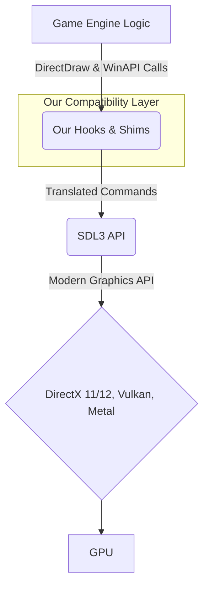

# A Game-Agnostic Guide to Modernizing DirectDraw Applications with SDL3

## Introduction

Legacy games built with Microsoft's DirectDraw API, especially those from the late 90s and early 2000s, face significant challenges running on modern operating systems. Issues like broken fullscreen modes, poor performance, and incompatibility with modern graphics APIs and overlays are common.

This document provides a comprehensive, game-agnostic blueprint for intercepting a game's DirectDraw rendering and input pipeline and replacing it with a modern SDL3 backend. This approach preserves the original game logic while leveraging the power, compatibility, and flexibility of modern graphics APIs like DirectX 11/12, Vulkan, or Metal.

The core philosophy is to create a "compatibility shim" that translates the game's legacy commands into modern equivalents, making the game engine believe it's still talking to DirectDraw.

---

## Chapter 1: The Hijacking Strategy - A High-Level Overview

Our strategy is built on two fundamental pillars:

1.  **Renderer & Surface Hijacking**: We intercept all of the game's attempts to create and manipulate DirectDraw surfaces. Instead of allowing it to create real `IDirectDrawSurface` objects, we provide our own fake objects that are secretly backed by `SDL_Texture`s. All drawing operations (`Lock`, `Blt`, `Flip`) are then rerouted to corresponding SDL3 rendering commands.

2.  **Window & Input Hijacking**: We take control of the game's window creation and its message loop. We create the main window using SDL3 but provide its native window handle (`HWND`) to the game. We then subclass the window's procedure to create a hybrid input system where both the original game logic and modern systems (SDL3, ImGui) can coexist and receive the input they need.

The data flow looks like this:



---

## Chapter 2: Renderer & Surface Hijacking in Detail

This is the heart of the system. We must trick the game into drawing into our SDL-managed textures instead of legacy DirectDraw surfaces.

### 2.1. The Entry Point: Intercepting `DirectDrawCreate`

The first step for any DirectDraw application is to initialize the main `IDirectDraw` object. This is typically done via `DirectDrawCreate` or a similar function.

**Hook Target**: The game's primary DirectDraw initialization function. This might be a direct call to `DirectDrawCreate` or, more commonly, an internal engine function that wraps this call (like `initDirectDraw` in the reference project).

**Hook Implementation (`initDirectDraw_new`)**:
1.  **Prevent Original Execution**: The hook must immediately return success to the game without calling the original function. This stops any real DirectDraw objects from being created.
2.  **Initialize SDL3**: This is the moment to call `SDL_Init()` and set up the core SDL3 context (`InitializeSDL3Context`).
3.  **Instantiate Dummy Objects**: We create C++ objects or C-style structs that serve as our fake DirectDraw interfaces. These do not need to be complete implementations, but they must exist in memory.
4.  **Overwrite Global Pointers**: The game engine will store the pointers to the `IDirectDraw` object and its surfaces in global variables. Your hook needs to identify these global pointers and overwrite them with the addresses of your dummy objects.

   *Example*: If the game stores its primary `IDirectDraw` interface pointer at a static address, your hook would do:
   ```cpp
   // Find where the game stores its main DirectDraw pointer.
   void** ppGameDirectDraw = (void**)GAME_DIRECTDRAW_GLOBAL_POINTER_ADDRESS;
   
   // Create our fake object.
   static MyFakeDirectDraw g_fakeDDraw;
   
   // Point the game's pointer to our fake object.
   *ppGameDirectDraw = &g_fakeDDraw;
   ```
   The reference code does this for multiple surfaces, which is the correct and necessary approach.

### 2.2. Faking Surfaces: `CreateSurface`

Once initialized, the game will create its rendering surfaces: the primary surface (the screen), a back buffer, and various off-screen surfaces for sprites, backgrounds, etc.

**Hook Target**: The `CreateSurface` method of the `IDirectDraw` interface. Since we replaced the main DirectDraw object with our fake one, the game will be calling the `CreateSurface` method on our fake object.

**Hook Implementation**:
1.  **Intercept the Call**: The game calls `CreateSurface` on your fake object, passing a `DDSURFACEDESC` structure describing the requested surface (width, height, etc.).
2.  **Create an `SDL_Texture`**: Instead of a DirectDraw surface, create an `SDL_Texture` with the requested dimensions. Critically, you should use `SDL_TEXTUREACCESS_TARGET` or `SDL_TEXTUREACCESS_STREAMING` so you can lock its pixels for writing.
3.  **Return a Dummy Surface Pointer**: Instantiate a *new fake surface struct/object*. This object must have a memory layout that mimics a real `IDirectDrawSurface` interface, especially the vtable if the game uses it. Store the newly created `SDL_Texture`'s pointer inside your fake surface object for later reference.
4.  **Update Game Pointers**: The game expects the `CreateSurface` call to return the new surface via a pointer-to-a-pointer argument. You must write the address of your new fake surface object here.

### 2.3. The Drawing Cycle: `Lock`, `Unlock`, and `Blt`

Games render by locking a surface to get a raw memory pointer, writing pixel data, and unlocking it.

**Hook Target**: The `Lock`, `Unlock`, and `BltFast` methods of your fake surface interface.

**`Lock` Hook Implementation**:
1.  The game calls `Lock()` on your fake surface object.
2.  Your implementation retrieves the `SDL_Texture` associated with that fake surface.
3.  Call `SDL_LockTexture()`.
4.  Return the `void* pixels` and `int pitch` from SDL back to the game. The game now has a direct pointer to the memory of an SDL texture and will write its pixel data into it, unaware of the difference.

**`Unlock` Hook Implementation**:
1.  The game calls `Unlock()` on your fake surface.
2.  Retrieve the associated `SDL_Texture`.
3.  Call `SDL_UnlockTexture()`.

**`BltFast` / `Blt` Hook Implementation**:
1.  The game calls `BltFast()` to copy a rectangle from one fake surface to another.
2.  Your implementation identifies the source and destination fake surfaces.
3.  Retrieve their associated `SDL_Texture` pointers.
4.  Set the render target to the destination texture (`SDL_SetRenderTarget`).
5.  Render the source texture to the destination texture (`SDL_RenderTexture`). This perfectly emulates a blit operation using the GPU.

### 2.4. Presenting the Frame: `Flip`

At the end of a frame, the game calls `Flip()` to present the back buffer. This is your cue to draw the final scene.

**Hook Target**: The `Flip` method of your fake primary surface, or more likely, the game's main render loop function (like `ProcessScreenUpdatesAndResources_new`).

**Hook Implementation**:
1.  **Set Window Render Target**: Call `SDL_SetRenderTarget(renderer, nullptr)` to ensure subsequent drawing goes to the main window.
2.  **Render the Game Scene**: Take the `SDL_Texture` that acts as your back buffer (the one the game has been drawing to) and render it to the window. This is the perfect place to implement aspect-ratio correct scaling (`RenderGameToWindow`).
3.  **Render Overlays**: Now that the game scene is drawn, render any modern overlays on top, such as an ImGui interface (`RenderImGuiSDL3`).
4.  **Present**: Call `SDL_RenderPresent()` to show the final, composited frame on screen.

---

## Chapter 3: Window & Input Hijacking

To seamlessly integrate SDL3, we must also take control of the game's window and its input processing.

### 3.1. The Entry Point: `CreateWindowEx`

**Hook Target**: The game's call to `CreateWindowExA` or its internal wrapper function (`CreateMainWindow_new`).

**Hook Implementation**:
1.  **Prevent Original Window Creation**: Do not call the original `CreateWindowExA`.
2.  **Create an SDL3 Window**: Call `SDL_CreateWindow()`. To ensure maximum compatibility, use flags like `SDL_WINDOW_RESIZABLE`.
3.  **Get the Native Handle**: Retrieve the native `HWND` from the SDL window.
   ```cpp
   HWND hwnd = (HWND)SDL_GetPointerProperty(SDL_GetWindowProperties(sdl_window), SDL_PROP_WINDOW_WIN32_HWND_POINTER, NULL);
   ```
4.  **Return the `HWND`**: Return this `HWND` to the game. The game engine now holds a handle to the SDL window and will treat it as its own.

### 3.2. The Bridge: Subclassing the Window Procedure

This is the most critical part of input handling. We need SDL to see events for its own systems (e.g., `SDL_GetKeyboardState`) and ImGui, but we also need the game to see events for its internal logic.

**The Technique**: Use `SetWindowLongPtrW(hwnd, GWLP_WNDPROC, ...)` to replace the SDL window's message procedure with our own custom one (`SDL3GameWindowProc`). Store the original SDL procedure for later.

**Custom Window Procedure (`SDL3GameWindowProc`) Logic**:
1.  A Windows message (`WM_KEYDOWN`, `WM_MOUSEMOVE`, etc.) arrives.
2.  Your custom procedure receives it first.
3.  **Forward to SDL**: Immediately pass the message to the **original SDL window procedure** using `CallWindowProc()`. This is **VITAL**. It allows SDL to update its internal keyboard state array, process mouse movements, and generate `SDL_Event`s that ImGui relies on.
4.  **Forward to Game**: After SDL has processed it, forward the message (especially keyboard messages) to the **game's original window procedure**. This ensures the game's hardcoded input logic continues to function.
5.  **Selective Filtering**: You can be selective. For example, you might choose *not* to forward mouse messages to the game when an ImGui menu is open, preventing the game from moving the camera while you interact with a UI window.

This creates the following message flow, satisfying all parties:
`OS Message -> Our Custom Proc -> SDL's Proc -> Game's Proc`

---

## Chapter 4: Special Case: 8-Bit Palettized Games

The reference project targets an 8-bit, 256-color game, which requires special handling because modern GPUs do not natively work with palettized formats.

**The Challenge**: The game doesn't write RGBA colors to the surface it `Lock()`s. It writes single-byte **palette indices**. A separate data structure in the game's memory holds the 256-entry color palette that maps these indices to actual RGB values.

**The Superior Solution: `SDL_Surface` with an `SDL_Palette`**
This is the most efficient method.
1.  **Create an 8-bit `SDL_Surface`**: When you initialize your system, create an `SDL_Surface` with an 8-bit indexed pixel format.
2.  **Create and Set an `SDL_Palette`**: Create an `SDL_Palette` object. Whenever the game updates its own color palette (e.g., by loading a new one or through a palette animation), your hooks must detect this and update your `SDL_Palette` object with the new RGB color data.
3.  **`memcpy` Indices**: In your main render loop, instead of a slow manual conversion, simply `memcpy` the block of 8-bit palette indices from the game's buffer directly into your 8-bit `SDL_Surface`'s pixel data.
4.  **Create Texture from Surface**: Call `SDL_CreateTextureFromSurface()`. This function is highly optimized. When you render this texture, the SDL renderer (and underlying graphics API) will perform the palette-to-RGBA lookup on the GPU, which is extremely fast.
5.  **Recreate Texture on Palette Change**: If the palette changes, you must recreate the texture from the surface again to apply the new colors.

## Chapter 5: Adapting for High-Color Games (16/24/32-bit)

The process is dramatically simpler for games that don't use palettes.

*   **32-bit (RGBA/BGRA)**: This is the easiest case. The game is already writing pixel data in a format the GPU understands. In your `Lock`/`Unlock` cycle, you can often just `memcpy` the game's frame buffer directly into the locked `SDL_Texture`'s buffer. The entire palette management system can be removed.

*   **16-bit (e.g., RGB565) or 24-bit (RGB)**: A pixel format conversion is still required. The `SDL_Surface` method remains the best approach here:
    1.  Create an `SDL_Surface` that matches the game's exact pixel format (e.g., `SDL_PIXELFORMAT_RGB565`).
    2.  `memcpy` the game's pixel buffer into the surface.
    3.  Use `SDL_CreateTextureFromSurface()` to have SDL perform the highly optimized conversion to a native 32-bit GPU texture format.
    4.  All of the `SDL_Palette` logic can be completely removed.

By following this blueprint, you can systematically decouple a legacy DirectDraw game from its outdated dependencies, paving the way for cross-platform support, modern features, and ensuring it remains playable for years to come. 
