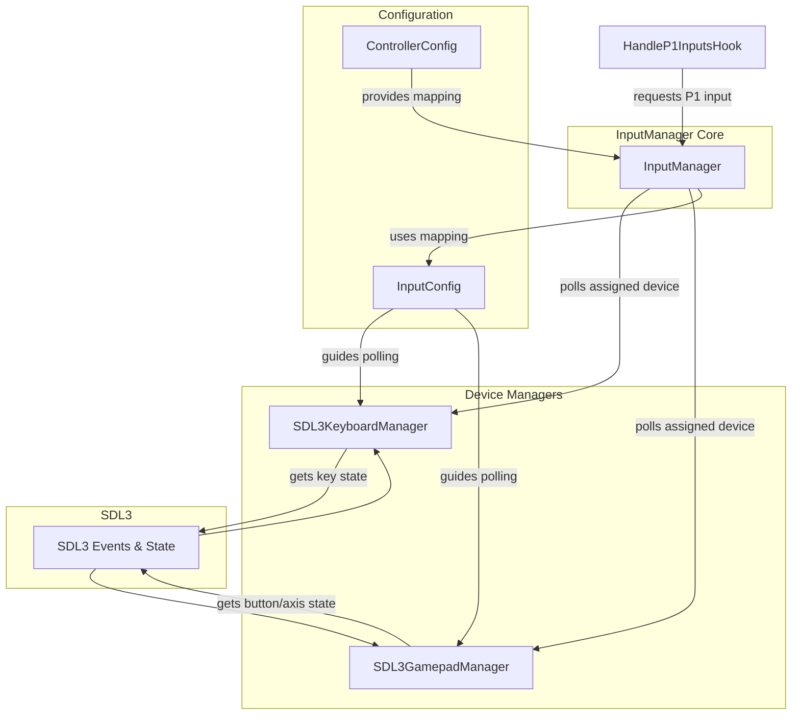

# Comprehensive Guide to the Modernized Input System

This document provides a detailed technical overview of the complete input system, which has been modernized to replace the game's original DirectInput implementation with a robust, feature-rich system based on SDL3. It covers the entire pipeline, from low-level engine hooks to high-level controller management, input recording, and netplay integration.

This system was designed to be modular and portable, allowing its components to be adapted for other projects.

## Core Architecture Overview

The input system is a multi-layered architecture designed to intercept the game's original input calls and replace them with a modern, flexible pipeline. The data flows from raw hardware input (keyboard, gamepads) through the SDL3 event system, into a centralized `InputManager`, and finally into the game engine in the precise format it expects.

```mermaid
graph TD
    subgraph Hardware
        direction LR
        A[Keyboard]
        B[Gamepads]
    end

    subgraph "OS / Driver Layer"
        direction LR
        C[Windows Messages]
        D[SDL3 Event System]
    end

    subgraph "Modern Input Pipeline"
        direction TB
        E[InputManager] --> F{Device Managers<br>(Keyboard/Gamepad)}
        E --> G[Controller Config<br>(Remapping, Slots)]
        F --> E
    end

    subgraph "Engine Hijacking Layer"
        direction TB
        H[simple_input_hooks.cpp]
        I[Context-Aware Logic<br>(Menu vs. Battle)]
        J[Input Converters]
        H --> I --> J
    end
    
    subgraph "Game Engine"
        direction TB
        K[Game Logic]
    end

    subgraph "External Systems"
        L[Rollback / Netplay<br>(GekkoNet)]
        M[Recording / Playback System]
    end

    A --> C --> H;
    B --> D --> F;
    J --> K;
    
    H -- "Override / Takeover" --> L
    H -- "Override / Takeover" --> M
    L -- "Provides Input" --> H
    M -- "Provides Input" --> H
```

### Key Components:

1.  **Engine Hooks (`simple_input_hooks.cpp`)**: The foundation of the system. It uses MinHook to intercept the game's original `HandleP1Inputs` and `HandleP2Inputs` functions. All input processing, whether from local devices, netplay, or playback, flows through these hooks.
2.  **`InputManager`**: The central hub of the modern input system. It abstracts away the underlying devices (keyboard, gamepad) and provides a unified interface for querying player input. It is responsible for device discovery, assignment, and hot-plugging.
3.  **Device Managers (`sdl3_keyboard_manager.cpp`, `sdl3_gamepad_manager.cpp`)**: These classes handle the specifics of communicating with each type of input device via SDL3. They read raw data from SDL3 and provide it to the `InputManager`.
4.  **Controller Configuration**: A user-facing system (accessed via F1) that allows for remapping buttons, assigning devices to players (P1/P2), and managing hot-plugged controllers.
5.  **Input Converters**: A series of functions that translate input data between different formats. This is crucial for compatibility between the modern SDL3-based system and the legacy game engine.
    *   `InputManager` -> `NEW_INPUT_*` format (a 32-bit bitmask).
    *   `NEW_INPUT_*` -> Game's legacy 8-bit format.
6.  **Context-Aware Edge Detection**: A critical piece of logic within the main input hooks that changes how input is processed based on the game's state (e.g., in a menu vs. in a battle). This prevents issues like rapid-fire selections in menus while still allowing buttons to be held down for moves in combat.
7.  **External System Bridges**: The input hooks contain logic to cede control to or accept input from the GekkoNet rollback system or the input recording/playback system.

## Part 1: Engine Hooking & Hijacking

The first step in replacing the original input system is to intercept the game's calls to its own input handling functions.

**File:** `simple_input_hooks.cpp`
**Tool:** [MinHook](https://github.com/TsudaKageyu/minhook)

### Hooking Process

The system targets two primary functions in the game's code:
*   `HandleP1Inputs` at `0x411280`
*   `HandleP2Inputs` at `0x411380`

The `installSimplifiedInputHooks` function uses MinHook to replace these functions with our own implementations: `HandleP1InputsHook` and `HandleP2InputsHook`.

```cpp
// from simple_input_hooks.cpp
bool installSimplifiedInputHooks() {
    // ...
    // Calculate function addresses
    uintptr_t baseAddr = (uintptr_t)GetModuleHandle(NULL);
    void* p1FuncAddr = (void*)(baseAddr + 0x11280);  // HandleP1Inputs at 0x411280
    void* p2FuncAddr = (void*)(baseAddr + 0x11380);  // HandleP2Inputs at 0x411380
    
    // Install P1 hook using MinHook
    MH_STATUS status1 = MH_CreateHook(p1FuncAddr, (void*)HandleP1InputsHook, (void**)&originalHandleP1Inputs);
    // ...
    MH_EnableHook(p1FuncAddr);

    // Install P2 hook using MinHook
    MH_STATUS status2 = MH_CreateHook(p2FuncAddr, (void*)HandleP2InputsHook, (void**)&originalHandleP2Inputs);
    // ...
    MH_EnableHook(p2FuncAddr);
    
    return true;
}
```
Once these hooks are active, every time the game tries to read input, it calls our code instead of its own. This gives us complete control over the input data that the game receives.

## Part 2: Raw Input Acquisition & Legacy Fallback

Before the `InputManager` was fully implemented, a simpler system based on Windows Messages was used. This system still exists as a fallback and for capturing keyboard events that are forwarded to the modern `InputManager`.

**File:** `simple_input_hooks.cpp`

### Window Message Hijacking

The primary SDL3 window's procedure is subclassed (replaced) with our own `SDL3GameWindowProc`. This allows us to intercept `WM_KEYDOWN`, `WM_KEYUP`, etc., messages before the game or even SDL3 can process them fully.

```cpp
// from sdl3_context.cpp
LRESULT CALLBACK SDL3GameWindowProc(HWND hWnd, UINT uMsg, WPARAM wParam, LPARAM lParam) {
    switch (uMsg) {
        case WM_KEYDOWN:
        case WM_KEYUP:
        // ...
            // CRITICAL: Update input state for our new input system
            UpdateInputFromWindowMessage(uMsg, wParam);
            
            // THEN forward to the game's window procedure
            return g_handleMenuCallHotkeys(hWnd, uMsg, wParam, lParam);
    //...
    }
}
```

The intercepted messages are passed to `UpdateInputFromWindowMessage`, which updates a global state structure:

```cpp
// from simple_input_hooks.cpp
static struct {
    bool initialized;
    bool keys[256];               // Current key state
    bool keys_consumed[256];      // Keys consumed this frame
    bool keys_held[256];          // Keys being held down
    unsigned int hold_duration[256]; // How long each key has been held
    int frame_counter;
} g_input_state = {0};

extern "C" void UpdateInputFromWindowMessage(UINT message, WPARAM wParam) {
    // ...
    switch (message) {
        case WM_KEYDOWN:
            g_input_state.keys[wParam & 0xFF] = true;
            break;
        case WM_KEYUP:
            g_input_state.keys[wParam & 0xFF] = false;
            break;
    }
}
```

This `g_input_state` provides a simple, legacy way to check keyboard state. It's used by the `ConvertWindowsKeysToML2Input` function, which serves as a fallback if the `InputManager` fails.

## Part 3: The Modern `InputManager`

The `InputManager` is the core of the new system. It provides a clean abstraction over different types of physical devices.

**Files:** `input/core/input_manager.hpp`, `input/devices/keyboard/sdl3_keyboard_manager.cpp`, `input/devices/gamepad/sdl3_gamepad_manager.cpp`

### Architecture



-   **`InputManager`**: A singleton that holds a list of available devices (keyboards and gamepads). It's responsible for assigning a specific device to a player slot (Player 1 or Player 2).
-   **Device Managers**: Each manager class is responsible for a single type of device.
    -   `SDL3KeyboardManager`: Tracks the state of one or more keyboards using `SDL_GetKeyboardState`.
    -   `SDL3GamepadManager`: Manages all connected gamepads using `SDL_OpenGamepad`, `SDL_GetGamepadButton`, etc. It handles hot-plugging (connect/disconnect events) by periodically refreshing the list of available gamepads.
-   **`InputConfig`**: A struct that defines the mapping from physical inputs (e.g., `SDL_SCANCODE_W`, `SDL_GAMEPAD_BUTTON_A`) to logical game actions (e.g., `NEW_INPUT_UP`, `NEW_INPUT_BTN_A`). The controller configuration UI modifies these configs.

When `HandleP1InputsHook` needs input, it calls `InputManager::getInstance().getInput(0)`. The `InputManager` then:
1.  Checks which device is assigned to Player 0.
2.  Retrieves the correct `InputConfig` for that device and player.
3.  Calls the appropriate device manager (`SDL3KeyboardManager` or `SDL3GamepadManager`).
4.  The device manager uses the `InputConfig` to check the state of the physical keys/buttons via SDL3 and returns a bitmask of the actions that are currently active.

## Part 4: Input Processing & Remapping

The system translates raw hardware inputs into a standardized internal format, `NEW_INPUT_*`.

### The `NEW_INPUT_*` Format
This is a 32-bit bitmask where each bit represents a logical game action.

**File:** `input/core/input_types.hpp`

```cpp
// from input/core/input_types.hpp (example)
const unsigned int NEW_INPUT_UP      = 1 << 0;
const unsigned int NEW_INPUT_DOWN    = 1 << 1;
const unsigned int NEW_INPUT_LEFT    = 1 << 2;
const unsigned int NEW_INPUT_RIGHT   = 1 << 3;
const unsigned int NEW_INPUT_BTN_A   = 1 << 4; // Corresponds to Light Attack
const unsigned int NEW_INPUT_BTN_B   = 1 << 5; // Corresponds to Medium Attack
const unsigned int NEW_INPUT_BTN_C   = 1 << 6; // Corresponds to Heavy Attack
// ... and so on
```

### Remapping

The `SDL3GamepadManager::getInput` and `SDL3KeyboardManager::getInput` methods are where remapping happens. They iterate through the provided `InputConfig` to build the `NEW_INPUT_*` bitmask.

```cpp
// Pseudo-code for SDL3GamepadManager::getInput
unsigned int SDL3GamepadManager::getInput(int gamepadIndex, const InputConfig& config) {
    unsigned int input_mask = 0;

    // Check digital buttons
    if (isButtonPressed(gamepadIndex, config.gamepad_mappings.a)) {
        input_mask |= NEW_INPUT_BTN_A;
    }
    if (isButtonPressed(gamepadIndex, config.gamepad_mappings.b)) {
        input_mask |= NEW_INPUT_BTN_B;
    }
    // ... etc for all buttons ...

    // Check D-Pad
    if (isButtonPressed(gamepadIndex, SDL_GAMEPAD_BUTTON_DPAD_UP)) {
        input_mask |= NEW_INPUT_UP;
    }
    // ... etc for D-Pad ...

    // Check analog stick
    float stick_x = getAxisValue(gamepadIndex, SDL_GAMEPAD_AXIS_LEFTX);
    float stick_y = getAxisValue(gamepadIndex, SDL_GAMEPAD_AXIS_LEFTY);
    if (stick_y < -DEADZONE) input_mask |= NEW_INPUT_UP;
    if (stick_y > +DEADZONE) input_mask |= NEW_INPUT_DOWN;
    // ... etc for analog stick ...

    return input_mask;
}
```

## Part 5: Game-Specific Input Conversion

The game engine doesn't understand the `NEW_INPUT_*` format. It expects a specific 8-bit integer where different bits represent different actions. The `convertNewToOldInputFormat` function handles this final, critical translation.

**File:** `simple_input_hooks.cpp`

```cpp
// from simple_input_hooks.cpp
extern "C" unsigned char convertNewToOldInputFormat(unsigned int newInput) {
    unsigned char oldInput = 0;
    
    // Convert directional inputs
    if (newInput & NEW_INPUT_UP)    oldInput |= 0x01; // Up
    if (newInput & NEW_INPUT_DOWN)  oldInput |= 0x02; // Down
    if (newInput & NEW_INPUT_LEFT)  oldInput |= 0x04; // Left
    if (newInput & NEW_INPUT_RIGHT) oldInput |= 0x08; // Right
    
    // Convert button inputs - A & B are swapped for a more standard layout
    if (newInput & NEW_INPUT_BTN_A) oldInput |= 0x40;  // Mapped to game's "B" button (Medium)
    if (newInput & NEW_INPUT_BTN_B) oldInput |= 0x20;  // Mapped to game's "A" button (Light)
    if (newInput & NEW_INPUT_BTN_C) oldInput |= 0x60;  // Mapped to game's "C" button (Heavy, A+B)
    
    // Start button (e.g., for menus)
    // if (newInput & NEW_INPUT_START) oldInput |= 0x10;
    
    return oldInput;
}
```

### Game's 8-Bit Input Format

| Bit    | Value | Game Action |
| ------ | ----- | ----------- |
| Bit 0  | `0x01`  | Up          |
| Bit 1  | `0x02`  | Down        |
| Bit 2  | `0x04`  | Left        |
| Bit 3  | `0x08`  | Right       |
| Bit 4  | `0x10`  | Start/Select|
| Bit 5  | `0x20`  | Button A (Light) |
| Bit 6  | `0x40`  | Button B (Medium)|
| Bit 7  | `0x80`  | (Button C is a combination of A+B, so 0x60) |


## Part 6: Context-Aware Edge Detection

A major challenge in fighting games is that in menus, you want a button press to register only once (edge detection) to avoid accidentally selecting multiple options. In a match, however, you need to be able to hold buttons down for charge moves or special attacks.

The input hooks implement this logic by checking the current game mode.

**File:** `simple_input_hooks.cpp`

```cpp
// from HandleP1InputsHook in simple_input_hooks.cpp

// Determine current game context for edge detection
bool isInMenuContext = true;
DWORD* currentGameMode = (DWORD*)(g_gameBaseAddress + OFFSET_CURRENTGAMEMODE);
if (currentGameMode) {
    int gameMode = *currentGameMode;
    // Battle contexts where held state is needed: BATTLE(14), PRACTICE, etc.
    isInMenuContext = (gameMode != 14); // 14 = GAMETYPE_BATTLE
}

// ... later in the function ...

auto& inputManager = argentum::input::InputManager::getInstance();
unsigned int newFormatInput = inputManager.getInput(0);

if (isInMenuContext) {
    // MENU CONTEXT: Apply edge detection to ACTION BUTTONS
    // (Movement is still held for scrolling)
    
    unsigned int actionBits = newFormatInput & (NEW_INPUT_BTN_A | NEW_INPUT_BTN_B | NEW_INPUT_BTN_C);
    unsigned int lastActionBits = lastInputManagerRaw & (NEW_INPUT_BTN_A | NEW_INPUT_BTN_B | NEW_INPUT_BTN_C);
    
    if (actionBits != 0 && actionBits == lastActionBits) {
        // Same action buttons as last frame - ignore to prevent repetition
        allowedActions = 0;
    } else {
        // New action buttons detected - allow them
        allowedActions = actionBits;
    }
    // ... combine with movement and update state ...
} else {
    // BATTLE CONTEXT: Use raw, unmodified input
    // This allows buttons to be held down.
}
```

This logic ensures the input feels responsive and correct in all parts of the game.

## Part 7: Advanced Systems Integration

The input hooks are the integration point for several advanced systems.

### Rollback / Netplay (`GekkoNet`)

When a netplay session is active (`g_gekko_offline_mode` is true), the local input collection is still performed, but it's immediately sent to GekkoNet. The input that is actually returned to the game engine comes *from* GekkoNet, which ensures both players' games are synchronized.

**File:** `simple_input_hooks.cpp`

```cpp
// from HandleP1InputsHook in simple_input_hooks.cpp

if (g_gekko_offline_mode && argentum::hooks::network::GekkoIntegration::IsSessionActive()) {
    inputSource = "GEKKO_ROLLBACK";
    
    if (!g_inputs_sent_this_frame) {
        // Capture local input from all players
        unsigned char p1LocalInput = ConvertWindowsKeysToML2Input(false, true);
        unsigned char p2LocalInput = ConvertWindowsKeysToML2Input(true, true);
        
        // Send inputs to GekkoNet
        argentum::hooks::network::GekkoIntegration::SetLocalInput(0, p1LocalInput);
        argentum::hooks::network::GekkoIntegration::SetLocalInput(1, p2LocalInput);
        
        g_inputs_sent_this_frame = true;
    }
    
    // Get synchronized inputs FROM GekkoNet (handles rollback automatically)
    uint16_t p1_input, p2_input;
    if (argentum::hooks::network::GekkoIntegration::GetPlayerInputs(p1_input, p2_input)) {
        input = (unsigned char)(p1_input & 0xFF);
    }
} else {
    // Standard local input path...
}
```

### Recording & Playback

The recording system hooks in at the very end of the input function, right before the value is returned to the game. This allows it to record the final, processed input and, if playback is active, to override it completely.

**File:** `simple_input_hooks.cpp`

```cpp
// from HandleP1InputsHook in simple_input_hooks.cpp

// ... all input processing happens above ...

// Record the final P1 input for this frame
argentum::practice::InputRecordingBridge::recordPlayerInput(0, input);

// Check if we should override with playback input
if (argentum::practice::InputRecordingBridge::shouldOverrideInput()) {
    unsigned char playbackInput = argentum::practice::InputRecordingBridge::getPlaybackInput(0);
    input = playbackInput; // Override final input
}

return input; // Return either original or playback input
```

## Part 8: Input Serialization (for Replays)

To save and load replays, the 8-bit input format needs to be serialized to a human-readable format.

**File:** `input_serializer.cpp`

This file contains functions to convert the 8-bit input value to and from a simple character-based notation.

-   `serializeInputDirection(unsigned char input)`: Converts the directional part (lower 4 bits) to numpad notation (`5` for neutral, `6` for right, `2` for down, `1` for down-left, etc.).
-   `serializeInputAttack(unsigned char input)`: Converts the button part to `A`, `B`, `C`, or a space.

```cpp
// from input_serializer.cpp

// Numpad notation mapping for directions
static char directionToNotation[16] = {
  '5', '8', '2', '|', '4', '7', '1', '<', '6', '9', '3', '>', '-', '^', 'V', '#'
};

char serializeInputDirection(unsigned char input) {
  return directionToNotation[input & 0xF];
}

char serializeInputAttack(unsigned char input) {
  return (input & 0x60) == 0x60 ? 'C' : input & 0x40 ? 'B' : input & 0x20 ? 'A' : ' ';
}
```

This allows a full replay to be stored as a simple text file, with one line per frame, e.g., `1,5, ,2,5, `.

This concludes the architectural overview of the input system. It's a robust, layered system that successfully replaces the game's original implementation with modern features while respecting the engine's legacy requirements.

---

## IV. Knowledge Summary

### What We Know

*   **Hook Addresses**: The exact memory addresses for the original P1 and P2 input handling functions are `0x411280` and `0x411380`, respectively.
*   **Game Input Format**: The engine expects an 8-bit integer where bits 0-3 are directions (Up, Down, Left, Right), bit 4 is Start, bit 5 is Light, and bit 6 is Medium. Heavy attack is a combination of Light+Medium (0x60).
*   **Modern Input Format**: Our `InputManager` uses a flexible 32-bit `NEW_INPUT_*` bitmask, which is then converted to the game's legacy format.
*   **Context Discovery**: The game state (menu vs. battle) can be reliably determined by reading the `DWORD` at `g_gameBaseAddress + OFFSET_CURRENTGAMEMODE`. A value of `14` indicates a battle context.
*   **Controller Configuration**: The F1 menu system successfully modifies the `InputConfig` structs, which are then used by the `InputManager` to provide remapped inputs. The configuration is saved to and loaded from a file.
*   **System Integration**: The input hooks serve as the definitive integration point for the rollback (`GekkoNet`) and record/playback systems, allowing them to override local input when active.

### What We Still Need to Discover

*   **Start Button Mapping**: The `convertNewToOldInputFormat` function does not currently map the `NEW_INPUT_START` bit to the game's `0x10` start bit. The exact `NEW_INPUT_*` bit that should correspond to the start button needs to be finalized and implemented.
*   **Obscure Input States**: The game may have other, less obvious states where input is handled differently (e.g., during certain character-specific animations or special UI screens). While the menu/battle distinction covers most cases, further edge cases may exist.
*   **Original DirectInput Behavior**: While we have replaced the input system, a full disassembly of the original DirectInput implementation has not been completed. There may be subtle behaviors (e.g., deadzone implementation, polling frequency) that are not perfectly replicated, although the current system is functionally superior. 