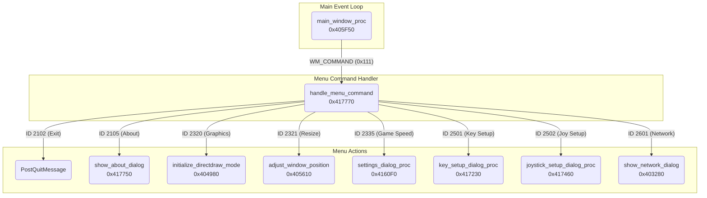

# FM2K Engine Rendering Pipeline and DirectDraw to SDL3 Migration

## Original DirectDraw Pipeline (FM2K Engine)

### Core Initialization Function (`initialize_directdraw_mode` @ 0x404980)
- Purpose: Sets up DirectDraw for hardware-accelerated rendering
- Key Steps:
  1. Increments graphics initialization counter
  2. Sets graphics busy flag
  3. Cleans up existing DirectDraw resources
  4. Creates DirectDraw object
  5. Sets cooperative level and display mode (640x480x16)
  6. Creates primary and back buffer surfaces

### Key Global Variables
- `g_graphics_mode` (0x424704): Controls rendering mode (0=GDI, 1=DirectDraw)
- `g_graphics_init_counter` (0x424770): Tracks initialization attempts
- `g_graphics_busy_flag`: Manages rendering state

### Surface Management
The original FM2K engine uses several DirectDraw surfaces:
- Primary Surface: Main display buffer
- Back Buffer: Double buffering for smooth rendering
- Sprite Surface (256x256): Dedicated sprite rendering buffer
- Graphics Surface: Additional buffer for UI/effects

## SDL3 Migration Strategy

### Core Architecture Changes

#### 1. Surface Replacement
```cpp
// Original DirectDraw Surfaces -> SDL3 Textures
SDL_Texture* g_primaryTexture;   // Replaces primary surface
SDL_Texture* g_backTexture;      // Replaces back buffer
SDL_Texture* g_spriteTexture;    // Replaces sprite surface (256x256)
SDL_Texture* g_graphicsTexture;  // Replaces graphics surface
```

#### 2. Dual Rendering System
- Game Buffer (256x240): Native game resolution
- Window Buffer: Scales to actual window size
- Maintains pixel-perfect rendering with nearest neighbor scaling

### Key Components

#### SDL3 Context Management
```cpp
struct SDL3Context {
    SDL_Window* window;
    SDL_Renderer* renderer;
    SDL_Texture* backBuffer;
    SDL_Texture* gameBuffer;
    SDL_Texture* spriteBuffer;
    int windowWidth;
    int windowHeight;
    int gameWidth;    // 256
    int gameHeight;   // 240
    bool isFullscreen;
    bool initialized;
};
```

#### DirectDraw Compatibility Layer
- Implements dummy DirectDraw interfaces
- Maps DirectDraw operations to SDL3 equivalents
- Handles surface locking/unlocking via SDL texture access

### Rendering Pipeline Changes

#### 1. Initialization
```cpp
bool InitializeSDL3Context(int isFullScreen, void* hwnd) {
    // Initialize SDL3 with video support
    // Create window and renderer
    // Set up game and window buffers
    // Configure nearest neighbor scaling
}
```

#### 2. Frame Rendering
1. Render game content to game buffer (256x240)
2. Scale game buffer to window size with proper aspect ratio
3. Apply any overlays/UI
4. Present final frame

#### 3. Surface Management
```cpp
bool CreateSDLTextures() {
    // Create all necessary SDL textures
    // Configure texture properties (format, access)
    // Set nearest neighbor scaling for pixel art
}
```

### Key Improvements

1. **Resolution Independence**
   - Proper scaling from native 256x240 to any window size
   - Maintains pixel-perfect rendering
   - Supports fullscreen toggle (Alt+Enter)

2. **Modern Graphics Pipeline**
   - DirectX 11 backend by default
   - Hardware acceleration
   - VSync support

3. **Better Color Handling**
   - RGBA8888 color format
   - Proper palette support
   - Improved color accuracy

### Migration Notes

1. **Surface Access**
   - DirectDraw surface locks map to SDL texture locks
   - Pixel format conversion handled automatically
   - Maintains compatibility with existing code

2. **Performance Considerations**
   - VSync for frame timing
   - Reduced CPU usage
   - Hardware-accelerated scaling

3. **Input Integration**
   - SDL3 event system for keyboard/gamepad
   - Window message forwarding for legacy input
   - Improved input responsiveness

## Window Management Strategy

### Original Window Creation (`initialize_game_window_and_graphics` @ 0x4056C0)
```cpp
// Window class registration
WNDCLASSA WndClass;
WndClass.style = 12288;  // CS_DBLCLKS | CS_OWNDC
WndClass.lpfnWndProc = main_window_proc;
WndClass.hInstance = hInstance;
// ... other window class setup ...

// Window creation
HWND hWnd = CreateWindowExA(
    0x40000,        // WS_EX_APPWINDOW
    "ClassName",    // Window class
    "WindowName",   // Window title
    0xF0000,        // WS_OVERLAPPED | WS_CAPTION | WS_SYSMENU | WS_MINIMIZEBOX
    x, y,           // Position
    640, 480,       // Size
    NULL, NULL,     // Parent window, menu
    hInstance,      // Instance
    NULL            // Additional data
);
```

### SDL3 Window Hijacking Strategy
```cpp
// 1. Let the game create its window normally
HWND gameWindow = CreateMainWindow_new(displayMode, hInstance, nCmdShow);

// 2. Hijack the window with SDL3
SDL_Window* sdlWindow = SDL_CreateWindowFrom(gameWindow);
if (!sdlWindow) {
    // Handle error
    return false;
}

// 3. Create DirectX 11 renderer
SDL_Renderer* renderer = SDL_CreateRenderer(sdlWindow, NULL, 
    SDL_RENDERER_ACCELERATED | SDL_RENDERER_PRESENTVSYNC);

// 4. Set up game buffers
SDL_Texture* gameBuffer = SDL_CreateTexture(renderer,
    SDL_PIXELFORMAT_RGB565,
    SDL_TEXTUREACCESS_STREAMING,
    640, 480);
```

### Key Differences

1. **Window Creation Flow**
   - Original: Direct Win32 API window creation
   - SDL3: Create game window first, then hijack with SDL

2. **Window Styles**
   - Original: Uses specific Win32 styles for game window
   - SDL3: Preserves original window styles through hijacking

3. **Graphics Context**
   - Original: GDI DC + DirectDraw surfaces
   - SDL3: SDL renderer + textures

### Benefits of Window Hijacking

1. **Compatibility**
   - Maintains original window behavior
   - Preserves window messages and input handling
   - Keeps original window styles and appearance

2. **Integration**
   - Allows SDL3 to manage the window content
   - Enables modern graphics features
   - Maintains native window feel

3. **Performance**
   - Direct hardware acceleration
   - Proper vsync support
   - Efficient scaling

## Window Procedure and Menu System

The game's user interface, including menus and configuration dialogs, is built using the standard Windows API. This section details the analysis of the main window procedure and the associated menu handling system. This is critical for the SDL3 migration, as the plan is to replace this UI system.

### Control Flow Diagram

The following diagram illustrates the control flow from the main window procedure to the various menu handlers and dialogs.



### Main Window Procedure (`main_window_proc` @ `0x405F50`)

This is the core `WndProc` for the main game window. It handles various window messages, including:
- **`WM_CREATE` (`0x01`):** Calls `adjust_window_position` (`0x405610`) to correctly position the window on creation.
- **`WM_DESTROY` (`0x02`):** Calls `PostQuitMessage` to terminate the application.
- **`WM_PAINT` (`0x0F`):** Handles rendering. In GDI mode (`g_graphics_mode = 0`), it calls `render_frame`. In DirectDraw mode, it does nothing, as rendering is handled separately.
- **`WM_KEYDOWN` (`0x100`):** Handles keyboard input, including debug hotkeys:
    - `S` key: Toggles between GDI and DirectDraw mode.
    - `P`: Toggles hitbox display.
    - `R`: Toggles replay mode.
    - `T`/`U`: Manipulate player health.
- **`WM_SYSKEYDOWN` (`0x105`):** Handles `Alt+Enter` to toggle fullscreen mode.
- **`WM_COMMAND` (`0x111`):** For menu actions, it calls `handle_menu_command` (`0x417770`) to process the specific menu item selected.

### Menu Command Handler (`handle_menu_command` @ `0x417770`)

This function acts as a dispatcher for all menu commands, using a `switch` statement on the menu item ID.

| Menu ID | Action                                           | Function Called                                        | Address    |
|---------|--------------------------------------------------|--------------------------------------------------------|------------|
| 2102    | Exit the application                             | `PostQuitMessage`                                      | (WinAPI)   |
| 2105    | Show the "About" dialog                          | `show_about_dialog`                                    | `0x417750` |
| 2320    | Toggle graphics mode (GDI/DirectDraw)            | `initialize_directdraw_mode`                           | `0x404980` |
| 2321    | Resize window to default 640x480                 | `adjust_window_position`                               | `0x405610` |
| 2335    | Open the "Game Speed" / Settings dialog          | `DialogBoxParamA` with `settings_dialog_proc`          | `0x4160F0` |
| 2501    | Open the "Key Setup" dialog                      | `DialogBoxParamA` with `key_setup_dialog_proc`         | `0x417230` |
| 2502    | Open the "Joystick Setup" dialog                 | `DialogBoxParamA` with `joystick_setup_dialog_proc`    | `0x417460` |
| 2601    | Open the "Network" configuration dialog          | `show_network_dialog`                                  | `0x403280` |

### Dialog Procedures

The configuration dialogs follow a standard WinAPI pattern, loading values from global variables on initialization and saving them back on closing.

-   **`settings_dialog_proc` @ `0x4160F0`**: Configures game settings like HP (`g_slider_hp_value`), guard durability (`g_slider_guard_value`), and round counts (`g_team_round`, `g_default_round`).
-   **`key_setup_dialog_proc` @ `0x417230`**: Maps keyboard keys for both players. Uses `key_name_converter` (`0x416650`) to display key names. Saves settings to `g_key_up`, `g_key_down`, etc.
-   **`joystick_setup_dialog_proc` @ `0x417460`**: Configures joystick buttons, saving to `g_joystick_primary_buttons` and `g_joystick_secondary_buttons`.
-   **`about_dialog_proc` @ `0x417700`**: A simple dialog that shows information about the application.
-   **`network_dialog_proc` @ `0x402ee0`**: Sets up a DirectPlay network session.

### SDL3 Message Handling and UI Replacement Strategy

The original UI will be replaced with an SDL-based implementation.
1.  **Window Subclassing/Hooking:** The original `main_window_proc` will be subclassed. Our new window procedure will intercept messages. This allows us to handle input via SDL's event system while still allowing some messages to pass through to the original `WndProc` if needed for compatibility. `Alt+Enter` for fullscreen will be handled by SDL.
2.  **Disable WinAPI Menu:** The existing menu bar will be removed by calling `SetMenu(hWnd, NULL);`.
3.  **Implement SDL UI:** A new UI will be rendered using SDL. This UI will be triggered by a hotkey (e.g., `F1`).
4.  **Direct Global Variable Modification:** The new UI will read and write settings directly to the known global variables (e.g., `g_graphics_mode`, `g_team_round`, `g_p1_key_config`), bypassing the original dialog procedures entirely.

## DirectDraw to SDL3 Transition

### Original DirectDraw Initialization
```cpp
HRESULT initialize_directdraw_mode() {
    g_graphics_init_counter++;
    g_graphics_busy_flag = 1;
    
    // Cleanup existing resources
    directdraw_cleanup();
    
    // Create DirectDraw object
    DirectDrawCreate(NULL, &g_ddraw, NULL);
    
    // Set cooperative level
    g_ddraw->SetCooperativeLevel(hWnd, 
        DDSCL_NORMAL | DDSCL_ALLOWMODEX | DDSCL_ALLOWREBOOT);
    
    // Create primary surface
    DDSURFACEDESC ddsd = {0};
    ddsd.dwSize = sizeof(ddsd);
    ddsd.dwFlags = DDSD_CAPS;
    ddsd.ddsCaps.dwCaps = DDSCAPS_PRIMARYSURFACE;
    g_ddraw->CreateSurface(&ddsd, &g_primary_surface, NULL);
    
    // Create back buffer
    ddsd.dwFlags = DDSD_WIDTH | DDSD_HEIGHT | DDSD_CAPS;
    ddsd.dwWidth = 640;
    ddsd.dwHeight = 480;
    ddsd.ddsCaps.dwCaps = DDSCAPS_OFFSCREENPLAIN;
    g_ddraw->CreateSurface(&ddsd, &g_back_buffer, NULL);
}
```

### SDL3 Replacement Strategy

1. **Initialization**
```cpp
bool InitializeSDL3Graphics() {
    // Create renderer with proper flags
    SDL_RendererFlags flags = SDL_RENDERER_ACCELERATED | 
                             SDL_RENDERER_PRESENTVSYNC;
    
    g_renderer = SDL_CreateRenderer(g_window, NULL, flags);
    
    // Force DirectX 11 backend
    CheckAndForceDirectX11Renderer();
    
    // Create game textures
    CreateSDLTextures();
    
    // Set up render targets
    SDL_SetRenderTarget(g_renderer, g_backBuffer);
}
```

2. **Surface Management**
```cpp
bool CreateSDLTextures() {
    // Create textures with proper access flags
    g_backBuffer = SDL_CreateTexture(g_renderer,
        SDL_PIXELFORMAT_RGB565,
        SDL_TEXTUREACCESS_STREAMING,
        640, 480);
        
    g_spriteBuffer = SDL_CreateTexture(g_renderer,
        SDL_PIXELFORMAT_RGB565,
        SDL_TEXTUREACCESS_STREAMING,
        256, 256);
}
```

3. **Mode Switching**
```cpp
void ToggleFullscreen() {
    if (SDL_GetWindowFlags(g_window) & SDL_WINDOW_FULLSCREEN_DESKTOP) {
        SDL_SetWindowFullscreen(g_window, 0);
    } else {
        SDL_SetWindowFullscreen(g_window, SDL_WINDOW_FULLSCREEN_DESKTOP);
    }
}
```

### Key Migration Points

1. **Window Management**
   - Subclass the window to handle specific messages
   - Install message hook for pre-window message processing
   - Let SDL handle most window messages

2. **Graphics Mode**
   - Replace DirectDraw surfaces with SDL textures
   - Use hardware-accelerated renderer
   - Handle mode switching through SDL

3. **Surface Access**
   - Map DirectDraw surface locks to SDL texture locks
   - Maintain compatible pixel formats
   - Handle surface blitting through SDL

4. **Performance**
   - Use DirectX 11 backend
   - Enable VSync for proper timing
   - Utilize hardware acceleration

## Implementation Details

### Key Functions

1. **Initialization**
```cpp
int __cdecl initDirectDraw_new(int isFullScreen, void* windowHandle) {
    // Initialize SDL3 context
    // Create necessary textures
    // Set up compatibility layer
}
```

2. **Rendering Loop**
```cpp
int __cdecl ProcessScreenUpdatesAndResources_new() {
    // Update SDL events
    // Handle input
    // Render game content
    // Scale and present
}
```

3. **Cleanup**
```cpp
void CleanupSDL3Context() {
    // Destroy textures
    // Clean up SDL resources
    // Reset state
}
```

### Migration Checklist

1. [ ] Initialize SDL3 with proper video flags
2. [ ] Create window with correct properties
3. [ ] Set up DirectX 11 renderer
4. [ ] Create necessary textures
5. [ ] Implement surface management
6. [ ] Set up input handling
7. [ ] Configure proper scaling
8. [ ] Test fullscreen toggle
9. [ ] Verify color accuracy
10. [ ] Optimize performance

## References

- Original FM2K Engine Analysis
- SDL3 Migration Strategy Document
- Surface Management Implementation
- DirectDraw Compatibility Layer 

## Additional Engine Components

### Dual Rendering System
The FM2K engine implements a dual rendering system:

1. **DirectDraw Mode** (`g_graphics_mode = 1`)
   - Hardware-accelerated rendering
   - Double buffered with page flipping
   - Primary surface and back buffer management
   - Fullscreen mode support

2. **GDI Fallback Mode** (`g_graphics_mode = 0`)
```cpp
// GDI rendering path
void render_frame_gdi() {
    HDC dc = GetDC(hWnd);
    SetStretchBltMode(dc, HALFTONE);
    
    if (windowWidth == 640 && windowHeight == 480) {
        BitBlt(dc, 0, 0, 640, 480, memDC, 0, 0, SRCCOPY);
    } else {
        StretchBlt(dc, 0, 0, windowWidth, windowHeight,
                  memDC, 0, 0, 640, 480, SRCCOPY);
    }
    ReleaseDC(hWnd, dc);
}
```

### Memory Management System
The engine uses a structured memory allocation system:

1. **Global Memory Pool**
   - Size: 0x138800 bytes
   - Allocated at startup
   - Used for various game subsystems

2. **Subsystem Memory Regions**
```cpp
struct MemoryRegions {
    uint8_t* playerStagePositions;  // 0x1AC bytes
    uint8_t* graphicsBuffer;        // 0xA00 bytes
    uint8_t* replaySystem;          // 0x701F8 bytes
    uint8_t* hitDetection;          // 0x124BC bytes
};
```

### Debug Features
The engine includes comprehensive debug functionality:

1. **Debug Key Bindings**
   - P: Toggle hit judge configuration
   - R: Toggle replay mode
   - T: Manipulate Player 2 HP
   - U: Manipulate Player 1 HP
   - {: Control round end flag

2. **Debug State Management**
```cpp
struct DebugState {
    bool hitJudgeEnabled;
    bool replayModeActive;
    bool debugModeEnabled;
    int roundEndFlag;
};
```

### Window Management Details

1. **Window Styles**
```cpp
// Window class configuration
WNDCLASSA wndClass = {
    .style = CS_DBLCLKS | CS_OWNDC,           // 12288
    .lpfnWndProc = MainWindowProc,
    .hbrBackground = NULL,
    .lpszMenuName = "CUPID_MENU"
};

// Window creation flags
DWORD exStyle = WS_EX_APPWINDOW;              // 0x40000
DWORD style = WS_OVERLAPPED | WS_CAPTION | 
              WS_SYSMENU | WS_MINIMIZEBOX;    // 0xF0000
```

2. **Window Sizing**
```cpp
int GetWindowDimensions(HWND hWnd, int* width, int* height) {
    int borderWidth = GetSystemMetrics(SM_CXSIZEFRAME) * 2;
    int titleHeight = GetSystemMetrics(SM_CYCAPTION);
    int borderHeight = GetSystemMetrics(SM_CYSIZEFRAME) * 2;
    
    *width = 640 + borderWidth;
    *height = 480 + titleHeight + borderHeight;
    return TRUE;
}
```

## SDL3 Migration Extensions

### Dual Renderer Support
```cpp
class SDL3RenderSystem {
public:
    bool initializeRenderer() {
        // Try hardware renderer first
        renderer = SDL_CreateRenderer(window, NULL,
            SDL_RENDERER_ACCELERATED | SDL_RENDERER_PRESENTVSYNC);
            
        if (!renderer) {
            return fallbackToSoftware();
        }
        return true;
    }
    
    bool fallbackToSoftware() {
        renderer = SDL_CreateRenderer(window, NULL,
            SDL_RENDERER_SOFTWARE | SDL_RENDERER_PRESENTVSYNC);
        return renderer != NULL;
    }
    
private:
    SDL_Renderer* renderer;
    bool isHardwareAccelerated;
};
```

### Memory Management Integration
```cpp
class SDL3MemorySystem {
public:
    struct MemoryPools {
        std::vector<uint8_t> stagePositions;   // 0x1AC
        std::vector<uint8_t> graphicsBuffer;    // 0xA00
        std::vector<uint8_t> replayBuffer;      // 0x701F8
        std::vector<uint8_t> hitDetectionBuffer;// 0x124BC
    };
    
    bool initialize() {
        pools.stagePositions.resize(0x1ACu);
        pools.graphicsBuffer.resize(0xA00u);
        pools.replayBuffer.resize(0x701F8u);
        pools.hitDetectionBuffer.resize(0x124BCu);
        return true;
    }
    
private:
    MemoryPools pools;
};
```

### Debug Integration
```cpp
class SDL3DebugSystem {
public:
    void handleDebugInput(const SDL_Event& event) {
        if (!debugEnabled) return;
        
        if (event.type == SDL_KEYDOWN) {
            switch (event.key.keysym.sym) {
                case SDLK_p: toggleHitJudge(); break;
                case SDLK_r: toggleReplayMode(); break;
                case SDLK_t: manipulatePlayer2HP(); break;
                case SDLK_u: manipulatePlayer1HP(); break;
                case SDLK_LEFTBRACE: incrementRoundEnd(); break;
            }
        }
    }
    
private:
    bool debugEnabled;
    bool hitJudgeEnabled;
    bool replayModeActive;
    int roundEndFlag;
};
```

### Window State Management
```cpp
class SDL3WindowManager {
public:
    struct WindowState {
        bool isFullscreen;
        bool isBusy;
        int initCounter;
        SDL_Point savedPosition;
        SDL_Point savedSize;
    };
    
    void saveWindowState() {
        SDL_GetWindowPosition(window, &state.savedPosition.x,
                            &state.savedPosition.y);
        SDL_GetWindowSize(window, &state.savedSize.x,
                         &state.savedSize.y);
    }
    
    void restoreWindowState() {
        if (!state.isFullscreen) {
            SDL_SetWindowPosition(window, state.savedPosition.x,
                                state.savedPosition.y);
            SDL_SetWindowSize(window, state.savedSize.x,
                            state.savedSize.y);
        }
    }
    
private:
    SDL_Window* window;
    WindowState state;
};
```

### Migration Notes

1. **Mode Switching**
   - Alt+Enter and 'S' key support maintained
   - Smooth transition between fullscreen/windowed
   - State preservation during mode changes

2. **Performance Considerations**
   - Hardware acceleration preferred
   - Software fallback available
   - VSync enabled for frame timing
   - Memory pools for consistent allocation

3. **Compatibility Layer**
   - Window styles preserved through SDL window
   - Debug features maintained
   - Original memory layout respected
   - Input handling preserved 