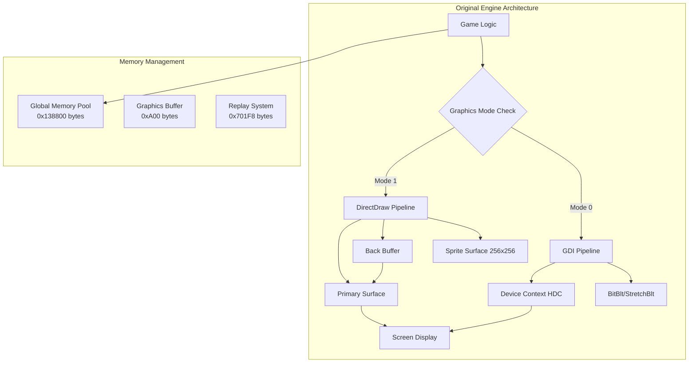
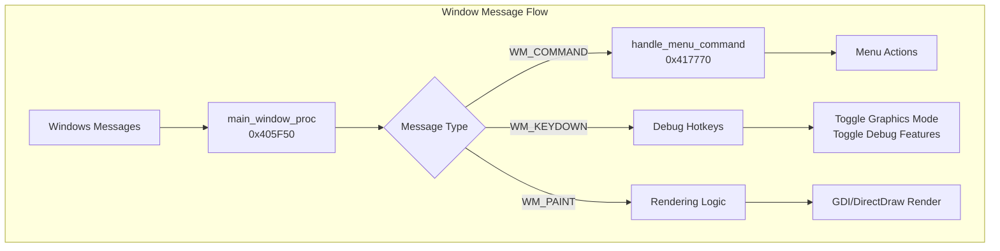
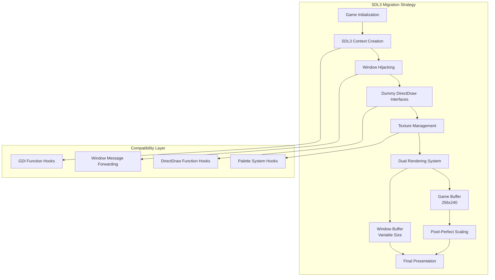
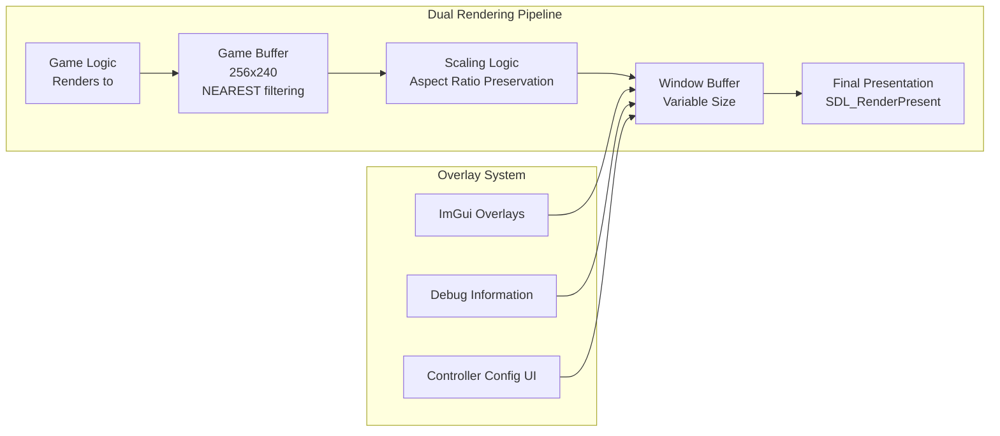
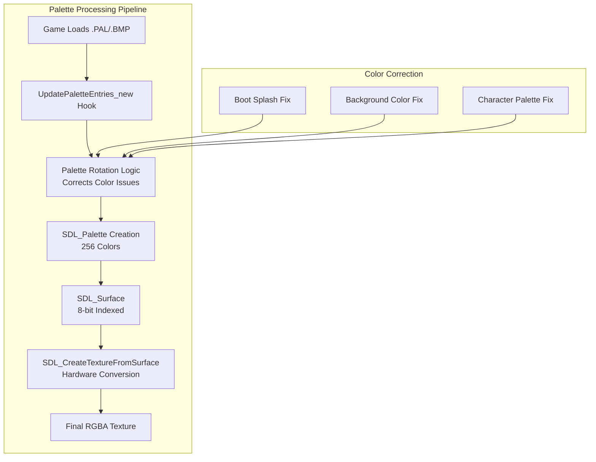

# Modernized Rendering Pipeline: A DirectDraw to SDL3 Migration Guide

This document provides a comprehensive technical deep-dive into the successful migration of the game's rendering engine from its original, legacy DirectDraw implementation to a modern, flexible, and hardware-accelerated pipeline powered by SDL3. It details the analysis of the original engine's architecture and the design and implementation of its replacement.

This system was designed to be modular and portable, allowing its components to be adapted for other projects.

---

## I. Analysis of the Original FM2K Engine Rendering Pipeline

A thorough understanding of the original engine was necessary to ensure a compatible and feature-complete replacement.

### A. Core Rendering Architecture

The engine featured a dual rendering system, allowing it to switch between a hardware-accelerated DirectDraw mode and a software-based GDI fallback mode.



#### 1. Window Creation (`initialize_game_window_and_graphics` @ `0x4056C0`)
The game creates a standard Win32 window with specific class properties and message handling.

```cpp
// Original Window Creation
WNDCLASSA WndClass;
WndClass.lpfnWndProc = main_window_proc; // The main message handler
WndClass.lpszMenuName = "CUPID_MENU";
WndClass.style = CS_DBLCLKS | CS_OWNDC;
// ... other properties

HWND hWnd = CreateWindowExA(
    WS_EX_APPWINDOW,
    "Moon Lights 2 Ver.1.07",
    "Moon Lights 2 Ver.1.07",
    WS_OVERLAPPED | WS_CAPTION | WS_SYSMENU | WS_MINIMIZEBOX,
    // ... position and size ...
);
```

#### 2. DirectDraw Initialization (`initialize_directdraw_mode` @ `0x404980`)
This function was responsible for setting up the hardware-accelerated rendering path.

**Key Steps**:
1. Creates the main `IDirectDraw` object via `DirectDrawCreate()`
2. Sets the `DDSCL_NORMAL` cooperative level
3. Creates a primary surface (represents the screen)
4. Creates a back buffer (640x480) for double buffering
5. Creates additional surfaces for sprites and UI elements

```cpp
// Original DirectDraw Initialization (reconstructed)
HRESULT initialize_directdraw_mode() {
    g_graphics_init_counter++;
    g_graphics_busy_flag = 1;
    
    // Cleanup existing resources
    directdraw_cleanup();
    
    // Create DirectDraw object
    DirectDrawCreate(NULL, &g_ddraw, NULL);
    
    // Set cooperative level
    g_ddraw->SetCooperativeLevel(hWnd, 
        DDSCL_NORMAL | DDSCL_ALLOWMODEX | DDSCL_ALLOWREBOOT);
    
    // Create primary surface
    DDSURFACEDESC ddsd = {0};
    ddsd.dwSize = sizeof(ddsd);
    ddsd.dwFlags = DDSD_CAPS;
    ddsd.ddsCaps.dwCaps = DDSCAPS_PRIMARYSURFACE;
    g_ddraw->CreateSurface(&ddsd, &g_primary_surface, NULL);
    
    // Create back buffer
    ddsd.dwFlags = DDSD_WIDTH | DDSD_HEIGHT | DDSD_CAPS;
    ddsd.dwWidth = 640;
    ddsd.dwHeight = 480;
    ddsd.ddsCaps.dwCaps = DDSCAPS_OFFSCREENPLAIN;
    g_ddraw->CreateSurface(&ddsd, &g_back_buffer, NULL);
    
    return S_OK;
}
```

#### 3. GDI Fallback Rendering (`render_frame_gdi`)
If DirectDraw failed or was disabled, the engine fell back to using the Windows GDI for software rendering.

```cpp
// GDI rendering path (reconstructed)
void render_frame_gdi() {
    HDC dc = GetDC(hWnd);
    SetStretchBltMode(dc, HALFTONE);
    
    if (windowWidth == 640 && windowHeight == 480) {
        BitBlt(dc, 0, 0, 640, 480, memDC, 0, 0, SRCCOPY);
    } else {
        StretchBlt(dc, 0, 0, windowWidth, windowHeight,
                  memDC, 0, 0, 640, 480, SRCCOPY);
    }
    ReleaseDC(hWnd, dc);
}
```

### B. Surface and Memory Management

The engine relied on a set of `IDirectDrawSurface` objects for all rendering operations:

| Surface Type | Purpose | Dimensions |
|--------------|---------|------------|
| **Primary Surface** | Represents the visible screen | Screen resolution |
| **Back Buffer** | Double buffering for smooth rendering | 640x480 |
| **Sprite Surface** | Dedicated sprite composition | 256x256 |
| **Graphics Surface** | UI elements and special effects | Variable |

**Memory Layout**:
- **Global Memory Pool**: 0x138800 bytes allocated at startup
- **Graphics Buffer**: 0xA00 bytes for rendering operations
- **Replay System**: 0x701F8 bytes for input recording
- **Hit Detection**: 0x124BC bytes for collision systems

### C. Window Procedure and Menu System

The entire user interface was built using standard Windows API with a central message dispatcher.



**Key Global Variables**:
- `g_graphics_mode` (0x424704): Controls rendering mode (0=GDI, 1=DirectDraw)
- `g_graphics_init_counter` (0x424770): Tracks initialization attempts
- `g_graphics_busy_flag`: Manages rendering state

---

## II. SDL3 Migration Architecture & Implementation

The migration strategy was to replace the entire DirectDraw and GDI rendering stack with an SDL3-based system, while preserving the original game's logic and behavior through a comprehensive compatibility layer.

### A. Core Strategy: Window Hijacking with Compatibility Layer



Instead of preventing the game from creating its window, we allow it to proceed and then "hijack" the created window handle (`HWND`) with SDL3.

**File:** `hooks/impl/sdl3_context.cpp`

```cpp
// from CreateMainWindow_new in sdl3_context.cpp
HWND __cdecl CreateMainWindow_new(int displayMode, HINSTANCE hInstance, int nCmdShow) {
    // 1. Initialize SDL3 if not already done
    if (!g_sdlContext.initialized) {
        if (SDL_Init(SDL_INIT_VIDEO | SDL_INIT_EVENTS | SDL_INIT_GAMEPAD) < 0) {
            return NULL;
        }
    }
    
    // 2. Create the SDL3 window with proper flags
    g_sdlContext.window = SDL_CreateWindow(
        "Moon Lights 2 Ver.1.07",
        windowWidth,
        windowHeight,
        SDL_WINDOW_RESIZABLE  // CRITICAL: Must be resizable for fullscreen toggle
    );
    
    // 3. Force DirectX 11 renderer for optimal performance
    SDL_PropertiesID rendererProps = SDL_CreateProperties();
    SDL_SetStringProperty(rendererProps, SDL_PROP_RENDERER_CREATE_NAME_STRING, "direct3d11");
    SDL_SetNumberProperty(rendererProps, SDL_PROP_RENDERER_CREATE_PRESENT_VSYNC_NUMBER, 1);
    g_sdlContext.renderer = SDL_CreateRendererWithProperties(rendererProps);
    SDL_DestroyProperties(rendererProps);
    
    // 4. Get the native HWND from the SDL3 window
    HWND hwnd = (HWND)SDL_GetPointerProperty(
        SDL_GetWindowProperties(g_sdlContext.window), 
        SDL_PROP_WINDOW_WIN32_HWND_POINTER, 
        NULL
    );
    
    // 5. Subclass the window to intercept and forward messages
    SubclassSDL3Window(hwnd);
    
    // 6. Return the HWND to the game - it now operates on an SDL3-managed window
    return hwnd;
}
```

### B. Graphics Context and Surface Replacement

All `IDirectDrawSurface` objects are replaced with `SDL_Texture` objects, managed by an `SDL_Renderer` with forced DirectX 11 backend.

**File:** `hooks/impl/sdl3_directdraw_compat_new.cpp`

```cpp
// from initDirectDraw_new in sdl3_directdraw_compat_new.cpp
int __cdecl initDirectDraw_new(int isFullScreen, void* windowHandle) {
    // Initialize SDL3 context if needed
    if (!InitializeSDL3Context(isFullScreen, windowHandle)) {
        return 0;
    }
    
    // Create SDL textures to replace DirectDraw surfaces
    if (!CreateSDLTextures()) {
        return 0;
    }
    
    // Set up dummy DirectDraw interfaces for compatibility
    void** pThis = (void**)0x439848;
    *pThis = &g_dummyDirectDraw; // Points to a fake DirectDraw object
    
    void** pBackBuffer = (void**)0x439854;
    *pBackBuffer = &g_backSurface; // Points to a struct that wraps our SDL_Texture
    
    void** pspriteSurface = (void**)0x439850;
    *pspriteSurface = &g_spriteSurface; // 256x256 sprite texture
    
    // Set up critical game variables
    int* pMaxWidth = (int*)0x6B3060;
    int* pMaxHeight = (int*)0x6B305C;
    int* pBitCount = (int*)0x6B3058;
    *pMaxWidth = 256;  // Native game width
    *pMaxHeight = 240; // Native game height
    *pBitCount = 8;    // 8-bit palettized
    
    return 1;
}
```

### C. The Dual-Rendering System for Pixel-Perfect Scaling

A major improvement is the implementation of a dual-buffer rendering system to handle resolution scaling correctly while maintaining the game's pixel-art aesthetic.



1. **Game Buffer (`g_sdlContext.gameBuffer`)**: An `SDL_Texture` fixed at the game's native internal resolution (**256x240**). All original game rendering is directed to this texture.
2. **Window Buffer (The Window Itself)**: The final, visible buffer presented to the user at any resolution.

**File:** `hooks/impl/sdl3_context.cpp`

```cpp
// from RenderGameToWindow in sdl3_context.cpp
void RenderGameToWindow() {
    // Set render target to the window (nullptr = default framebuffer)
    SDL_SetRenderTarget(g_sdlContext.renderer, nullptr);
    SDL_SetRenderDrawColor(g_sdlContext.renderer, 0, 0, 0, 255);
    SDL_RenderClear(g_sdlContext.renderer);
    
    // Get actual window dimensions
    int actualWindowWidth, actualWindowHeight;
    SDL_GetWindowSize(g_sdlContext.window, &actualWindowWidth, &actualWindowHeight);
    
    // Calculate scaling to maintain aspect ratio and center the game
    float windowAspect = (float)actualWindowWidth / actualWindowHeight;
    float gameAspect = (float)g_sdlContext.gameWidth / g_sdlContext.gameHeight;  // 256/240 = 1.067
    
    SDL_FRect destRect;
    if (windowAspect > gameAspect) {
        // Window is wider - letterbox on sides
        float scale = (float)actualWindowHeight / g_sdlContext.gameHeight;
        destRect.w = g_sdlContext.gameWidth * scale;
        destRect.h = (float)actualWindowHeight;
        destRect.x = (actualWindowWidth - destRect.w) / 2;
        destRect.y = 0;
    } else {
        // Window is taller - letterbox on top/bottom
        float scale = (float)actualWindowWidth / g_sdlContext.gameWidth;
        destRect.w = (float)actualWindowWidth;
        destRect.h = g_sdlContext.gameHeight * scale;
        destRect.x = 0;
        destRect.y = (actualWindowHeight - destRect.h) / 2;
    }
    
    // Render the scaled game buffer to the window using NEAREST_NEIGHBOR filtering
    SDL_RenderTexture(g_sdlContext.renderer, g_sdlContext.gameBuffer, nullptr, &destRect);
}
```

### D. The Main Rendering Loop (`ProcessScreenUpdatesAndResources_new`)

This hooked function is the heart of the new rendering engine, called every frame by the game's main loop.

**File:** `hooks/impl/sdl3_directdraw_compat_new.cpp`

```cpp
// from ProcessScreenUpdatesAndResources_new
int __cdecl ProcessScreenUpdatesAndResources_new() {
    // 1. Update SDL events for input and window management
    UpdateSDL3Events();
    
    // 2. Handle palette updates and color conversion
    if (*pResourceHandlerState != 2) {
        // Lock sprite texture for pixel updates
        void* pixels;
        int pitch;
        if (SDL_LockTexture(g_spriteTexture, NULL, &pixels, &pitch) < 0) {
            return 0;
        }
        
        // Get source data from game's rendering buffer
        unsigned char* srcData = (unsigned char*)*ppBitDepth;
        
        // Use SDL3 native palette approach for color accuracy
        if (SDL_LockSurface(g_indexedSurface)) {
            unsigned char* indexedPixels = (unsigned char*)g_indexedSurface->pixels;
            int indexedPitch = g_indexedSurface->pitch;
            
            // Direct copy of palette indices - SDL3 handles conversion
            for (int y = 0; y < 240; y++) {
                memcpy(indexedPixels + y * indexedPitch, srcData + y * 256, 256);
            }
            
            SDL_UnlockSurface(g_indexedSurface);
            
            // Recreate texture from indexed surface with updated palette
            if (g_paletteTexture) {
                SDL_DestroyTexture(g_paletteTexture);
            }
            g_paletteTexture = SDL_CreateTextureFromSurface(g_sdlContext.renderer, g_indexedSurface);
            SDL_SetTextureScaleMode(g_paletteTexture, SDL_SCALEMODE_NEAREST);
        }
        
        SDL_UnlockTexture(g_spriteTexture);
        
        // 3. Render to game buffer (256x240)
        SDL_SetRenderTarget(g_sdlContext.renderer, g_sdlContext.gameBuffer);
        SDL_SetRenderDrawColor(g_sdlContext.renderer, 0, 0, 0, 255);
        SDL_RenderClear(g_sdlContext.renderer);
        
        SDL_Texture* renderTexture = g_paletteTexture ? g_paletteTexture : g_spriteTexture;
        SDL_FRect destRect = {0, 0, 256, 240};
        SDL_RenderTexture(g_sdlContext.renderer, renderTexture, NULL, &destRect);
    }
    
    // 4. The DirectDraw compatibility layer IS the main rendering loop
    // Scale game buffer to window
    RenderGameToWindow();
    
    // 5. Render ImGui overlays on top
    RenderImGuiSDL3();
    
    // 6. Present the final frame
    PresentFrame();
    
    return 0;
}
```

### E. Palette and Color Management

The original game uses 8-bit palettized graphics. The new system must accurately convert this to 32-bit RGBA for modern hardware.

**File:** `hooks/impl/palette_system.cpp`



Key components:
- **`SDL_Palette`**: Holds the 256 colors used by the game
- **`UpdatePaletteEntries_new`**: Intercepts palette loading from files
- **`g_indexedSurface`**: 8-bit intermediary surface for efficient conversion
- **Hardware Conversion**: `SDL_CreateTextureFromSurface` performs GPU-accelerated color lookup

```cpp
// from UpdatePaletteEntries_new in palette_system.cpp
int __cdecl UpdatePaletteEntries_new(int startIndex, unsigned int entryCount, 
                                    char* colorData, unsigned int colorFormat) {
    // Validate inputs
    if (colorFormat >= 2 || startIndex >= 256) {
        return -1;
    }
    
    // Determine if rotation should be applied
    bool applyRotation = false;
    int customRotation = 0;
    
    if (startIndex == 0) {
        // BMP files start at index 0 - NO rotation (direct copy like original)
        applyRotation = false;
        if (entryCount == 99) {
            printf("PALETTE: Boot splash BMP - direct copy (NO rotation)\n");
        }
    } else {
        // Non-BMP elements - use global rotation for color correction
        applyRotation = true;
        customRotation = g_palette_rotation;
    }
    
    // Process color data with optional rotation
    unsigned char* tempPalette = (unsigned char*)malloc(4 * entryCount);
    for (int i = 0; i < entryCount; i++) {
        int src_index = applyRotation ? (i + customRotation) % 256 : i;
        // ... color format conversion logic ...
    }
    
    // Update SDL3 palette for major changes
    if (isMajorUpdate && g_sdlContext.initialized) {
        UpdateSDL3Palette(tempPalette);
    }
    
    free(tempPalette);
    return 0;
}
```

### F. GDI Compatibility and UI Replacement

**File:** `hooks/graphics/gdi_hooks.cpp`

The original WinAPI calls are intercepted to maintain compatibility:

```cpp
// from GetDeviceCaps_new in gdi_hooks.cpp
int WINAPI GetDeviceCaps_new(HDC hdc, int index) {
    int result = o_GetDeviceCaps ? o_GetDeviceCaps(hdc, index) : GetDeviceCaps(hdc, index);
    
    // Intercept BITSPIXEL requests and return 8-bit color depth
    if (index == BITSPIXEL) {
        printf("GDI HOOK: **BITSPIXEL INTERCEPTED** - returning 8-bit instead of %d-bit\n", result);
        return 8;  // Fake 8-bit color depth for ML2 compatibility
    }
    
    return result;
}
```

**UI Replacement Strategy**:
- Original WinAPI menu disabled via `SetMenu(hWnd, NULL)`
- New ImGui-based UI rendered on top of scaled game content
- Direct manipulation of global game variables (bypassing original dialogs)
- F1 controller configuration menu with full remapping support

---

## III. Advanced Features and Optimizations

### A. Fullscreen Management

```cpp
// from ToggleFullscreen in sdl3_context.cpp
bool ToggleFullscreen() {
    Uint32 flags = SDL_GetWindowFlags(g_sdlContext.window);
    bool isFullscreen = (flags & SDL_WINDOW_FULLSCREEN) != 0;
    
    if (isFullscreen) {
        // Switch to windowed mode
        SDL_SetWindowFullscreen(g_sdlContext.window, false);
        SDL_SetWindowBordered(g_sdlContext.window, true);
        SDL_SetWindowSize(g_sdlContext.window, 640, 480);
        SDL_SetWindowPosition(g_sdlContext.window, SDL_WINDOWPOS_CENTERED, SDL_WINDOWPOS_CENTERED);
    } else {
        // Switch to fullscreen mode
        SDL_SetWindowFullscreen(g_sdlContext.window, true);
    }
    
    return true;
}
```

### B. Performance Optimizations

1. **Hardware Acceleration**: Forced DirectX 11 backend for optimal Windows performance
2. **VSync Support**: Eliminates screen tearing while maintaining 60fps
3. **Efficient Scaling**: GPU-accelerated nearest-neighbor filtering preserves pixel art
4. **Memory Management**: Reduced allocations through texture reuse
5. **Event-Driven Updates**: SDL3 events processed once per frame to avoid jitter

### C. Debug and Development Features

- **Renderer Backend Detection**: Runtime switching between graphics backends
- **Performance Monitoring**: Frame timing and backend information display
- **Hot-Key Support**: F5/F6 for renderer backend testing
- **Comprehensive Logging**: Detailed debug output for troubleshooting

---

## IV. Knowledge Summary

### What We Know

- **Complete Rendering Flow**: Full understanding of both DirectDraw and GDI rendering paths from window creation to frame presentation
- **Memory Addresses**: All relevant global graphics variables, surfaces, and function addresses documented
- **Window Management**: Complete analysis of message handling, menu dispatch, and dialog systems
- **Color System**: 8-bit palettized format fully understood, including palette loading and color correction
- **Internal Resolution**: Game renders at exactly 256x240 pixels internally
- **Surface Layout**: All DirectDraw surface types, their purposes, and memory layouts mapped
- **Hook Points**: Successful interception of all critical rendering functions via MinHook
- **SDL3 Integration**: Complete replacement of DirectDraw/GDI with modern SDL3 pipeline
- **Compatibility Layer**: Dummy interfaces maintain game logic compatibility
- **Performance**: DirectX 11 backend provides optimal hardware acceleration

### What We Still Need to Discover

- **Obscure Rendering Functions**: Some lesser-used blitting or drawing functions for specific effects (fades, transitions) may exist but haven't been identified
- **VRAM Access Patterns**: While we emulate DirectDraw surfaces, exact memory layouts and access patterns for certain graphical assets aren't fully mapped
- **Advanced DirectDraw Features**: Some DirectDraw capabilities (like hardware overlays or specific blending modes) may not be perfectly replicated
- **Edge Case Handling**: Rare rendering scenarios during specific game states may have unique requirements not yet discovered

### Future Enhancements

- **Multi-Monitor Support**: Extending fullscreen handling for multi-monitor setups
- **Additional Backends**: Support for Vulkan or DirectX 12 backends for future compatibility
- **Enhanced Scaling**: Integer scaling options and custom scaling algorithms
- **Shader Support**: Custom fragment shaders for visual effects or filters
- **Recording Integration**: Built-in screenshot and video recording capabilities 