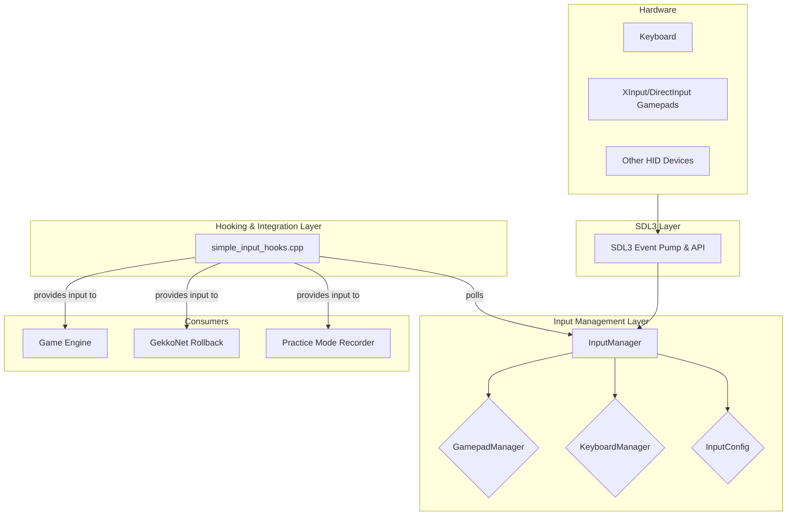
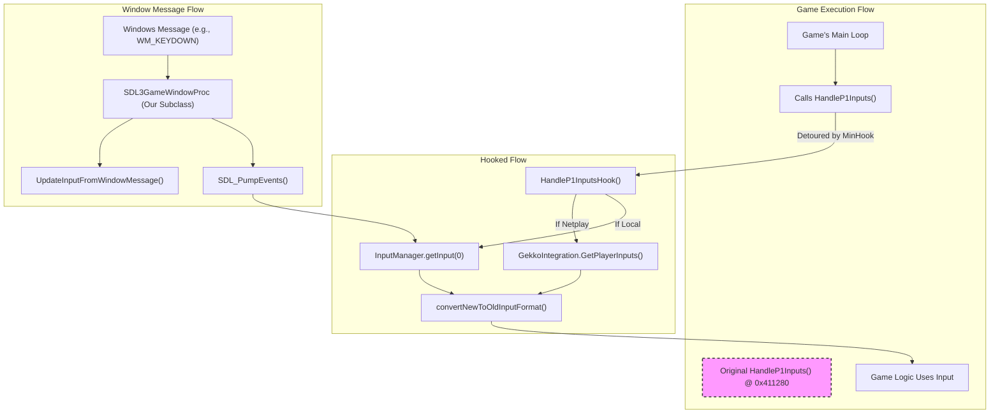

# ML2 - Modern Input System Architecture

This document details the architecture of the new SDL3-based input system, its integration with the original game engine, the netplay/rollback system, and the plan for future refactoring.

## 1. Original Input System (Legacy)

The original game used a combination of DirectInput and standard WinAPI messages for input processing.

-   **Core Functions**: The engine reads player inputs from two primary functions:
    -   `HandleP1Inputs` @ `0x411280`
    -   `HandleP2Inputs` @ `0x411380`
-   **Input Data Format**: Each function returns a single `unsigned char` where specific bits correspond to directions and action buttons. This 8-bit value is used throughout the game's logic.
-   **Menu Input**: Menu and UI navigation inputs were handled separately within the main window procedure (`main_window_proc` @ `0x405F50`), which processed `WM_KEYDOWN` and other window messages.

## 2. New SDL3 Input System Architecture

The new system is designed to be modular, extensible, and compatible with modern hardware. It abstracts away the complexities of different input APIs and provides a unified interface for the game.

### System Diagram

### Core Components

-   **`InputManager`** (`caster_lib/input/core/input_manager.hpp`):
    -   A singleton that serves as the central hub for all input processing.
    -   Manages a list of connected devices (keyboards, gamepads).
    -   Assigns devices to player slots (e.g., Player 1, Player 2).
    -   The main `getInput(playerIndex)` method polls the appropriate device manager and returns a unified 32-bit input state (`NEW_INPUT_*` format).

-   **`GamepadManager`** (`hooks/input/gamepad_manager.hpp`):
    -   Responsible for handling all SDL3 gamepad interactions.
    -   Detects gamepad connection and disconnection events.
    -   Reads axis, button, and D-pad states from `SDL_GameController`.
    -   Translates raw SDL gamepad data into the unified 32-bit `NEW_INPUT_*` format.

-   **`KeyboardManager`** (`hooks/input/keyboard_manager.hpp`):
    -   Responsible for handling all keyboard interactions.
    -   Reads key states from `SDL_GetKeyboardState()`.
    -   Translates SDL scancodes into the unified 32-bit `NEW_INPUT_*` format based on the current keymap for each player.

-   **`InputConfig`** (`hooks/input/input_config.hpp` and `menu/impl/controller_config.h`):
    -   Manages the mapping of physical buttons and keys to in-game actions.
    -   Provides a UI (triggered by F1) for users to customize their controls.
    -   Handles saving and loading of controller configurations.

-   **`InputConverter`** (`hooks/input/input_conversion.hpp`):
    -   A utility class to translate between different input formats.
    -   Its primary role is to convert the modern 32-bit `NEW_INPUT_*` format from the `InputManager` back to the legacy 8-bit format that the original game engine expects.

## 3. Hooking and Integration Strategy

The new system is injected into the game using function hooking, allowing us to intercept the original input calls and feed in data from our new system.

-   **Window Subclassing (`sdl3_context.cpp`)**:
    1.  The main game window is created using SDL3.
    2.  We use `SetWindowLongPtr` to replace SDL's internal window procedure with our own (`SDL3GameWindowProc`).
    3.  Our procedure, `SDL3GameWindowProc`, is now the first to receive all window messages.
    4.  It calls `UpdateInputFromWindowMessage` to maintain state for a legacy keyboard input path (used as a fallback).
    5.  Crucially, it forwards messages to SDL's original procedure, which converts them into `SDL_Event`s.
    6.  The `UpdateSDL3Events` function is called once per frame to pump these events, which updates the state for `SDL_GetKeyboardState` and `SDL_GameController` functions.

-   **Core Input Hooks (`simple_input_hooks.cpp`)**:
    1.  `installSimplifiedInputHooks` uses MinHook to replace the original `HandleP1Inputs` and `HandleP2Inputs` functions with our `HandleP1InputsHook` and `HandleP2InputsHook`.
    2.  Inside the hook, we first check if netplay is active.
    3.  **If Netplay**: We call `GekkoIntegration` to get the synchronized inputs for the current frame.
    4.  **If Local Play**: We call `InputManager::getInstance()->getInput()` to get the state from the assigned keyboard or gamepad.
    5.  The 32-bit input is then passed through a **context-aware edge detection** filter. This prevents a single keypress from registering on multiple frames in menus, while still allowing buttons to be held down in-game.
    6.  The result is converted back to the game's 8-bit format via `convertNewToOldInputFormat`.
    7.  The final value is returned to the game engine, which uses it transparently.

## 4. Rollback and Netplay Integration

The input system is designed for seamless netplay.

-   **GekkoNet Bridge**: The `GekkoIntegration` module acts as a bridge to the GekkoNet rollback library.
-   **Input Flow**:
    1.  On each frame, the input hooks capture the local player's input via the `InputManager`.
    2.  This input is sent to GekkoNet using `GekkoIntegration::SetLocalInput()`.
    3.  The hook then asks GekkoNet for the definitive inputs for the frame using `GekkoIntegration::GetPlayerInputs()`.
    4.  GekkoNet handles the rollback, prediction, and synchronization, returning the correct inputs for all players for that specific game frame.
    5.  This ensures that both local play and netplay use the exact same input pipeline, which is critical for preventing desyncs.

## 5. Future Refactoring and Improvements

The current implementation in `simple_input_hooks.cpp` is functional but monolithic. The next step is to refactor this logic into the dedicated manager classes for better organization and maintainability.

-   [ ] **Implement `GamepadManager`**: Move all SDL_GameController logic into this class.
-   [ ] **Implement `KeyboardManager`**: Move all `SDL_GetKeyboardState` logic and keymap handling into this class.
-   [ ] **Implement `InputConverter`**: Move `convertNewToOldInputFormat` and related functions into this class.
-   [ ] **Clean up `simple_input_hooks.cpp`**: The hook file should become very lightweight. Its main job will be to call the `InputManager` and pass the result to the game, with the manager classes handling all the details.
-   [ ] **Remove Legacy Path**: Once the `KeyboardManager` is fully implemented and stable, the old path using `UpdateInputFromWindowMessage` can be deprecated and removed.
-   [ ] **Enhance `InputConfig` UI**: Improve the F1 controller configuration menu with more options and better visual feedback. 