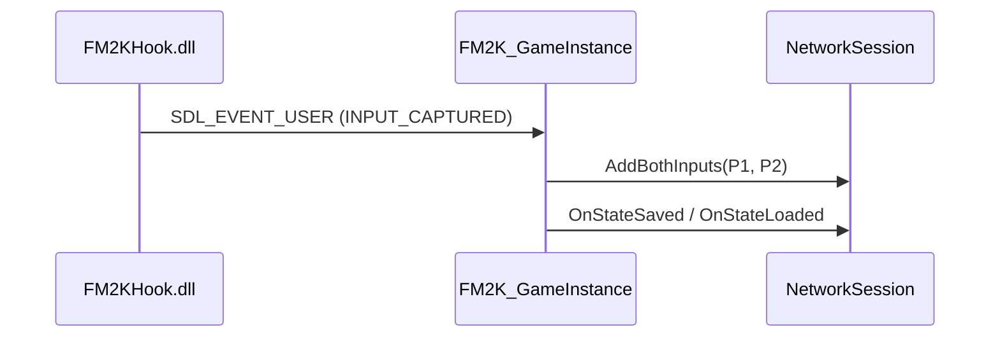

# FM2K Rollback Netcode Integration ? Session Mode Architecture Outline

## Table of Contents
1. Scope
2. Terminology
3. What We Know (Current Implementation)
   1. LocalSession Path
   2. IPC Event Flow
   3. NetworkSession / GekkoNetBridge
4. Design Goals
5. Session Modes
   1. LOCAL Mode Requirements
   2. ONLINE Mode Requirements
6. High-Level Architecture Overview
7. Components and Responsibilities
   1. Launcher (FM2K_RollbackClient)
   2. GameInstance (FM2K_GameInstance)
   3. IPC System (FM2KHook DLL ? Launcher)
   4. NetworkSession (GekkoNetBridge)
   5. UI Layer (ImGui-based LauncherUI)
8. Mode-Selection Mechanism
9. Detailed Task Breakdown (How)
10. What We Still Need to Discover / Open Questions
11. References (Code Locations)

---

## 1. Scope
This document outlines the architecture and implementation steps required to support two distinct session modes ? **LOCAL** (offline rollback testing) and **ONLINE** (remote peer-to-peer play) ? within the FM2K rollback integration.

## 2. Terminology
* **LOCAL Session**: Both players are emulated locally; rollback input pairs are forwarded directly from the FM2KHook IPC to `NetworkSession::AddBothInputs`.
* **ONLINE Session**: Each player runs an independent launcher instance. GekkoNet handles input exchange over UDP. `NetworkSession::AddLocalInput` is the primary entry point.
* **SessionMode**: An enum (`LOCAL`, `ONLINE`) to be introduced into `NetworkConfig`, acting as the single source of truth for mode selection.

## 3. What We Know (Current Implementation)
### 3.1 LocalSession Path
* `FM2KHook` DLL captures P1 and P2 inputs each frame and emits an IPC event `INPUT_CAPTURED`.
* `FM2K_GameInstance::HandleIPCEvent` forwards both inputs to `NetworkSession::AddBothInputs`.
* `NetworkSession` converts them to `FM2KInput` and calls `GekkoNetBridge::AddBothInputs`, enabling rollback without networking.
* State save/load callbacks are wired through IPC Å® `NetworkSession` Å® `FM2KGameInstance`.

### 3.2 IPC Event Flow


### 3.3 NetworkSession / GekkoNetBridge
* `NetworkSession` abstracts game-side state, input buffering, rollback decisions.
* `GekkoNetBridge` hosts the GekkoNet C API and hides UDP details.
* `NetworkSession::Start` was previously invoked from `FM2K_RollbackClient::LaunchGame` with hard-coded debug parameters, but this has been removed to allow for proper `SessionMode` selection.

## 4. Design Goals
* **Single Source of Truth** for session mode to avoid divergent paths.
* **Zero Regression**: Keep LocalSession behaviour unchanged while adding Online support.
* **Separation of Concerns**: Launcher UI chooses mode; `FM2K_GameInstance` and `NetworkSession` react accordingly without embedding UI logic.
* **Extensibility**: Allow future addition of Spectator mode without core rewrites.

## 5. Session Modes
### 5.1 LOCAL Mode Requirements
1. No socket creation.
2. DLL input hooks active; IPC delivers both playersÅf inputs.
3. Prediction window maximum two frames (configurable).
4. Useful for deterministic offline testing and debugging.

### 5.2 ONLINE Mode Requirements
1. UDP communication via GekkoNet (host/client topology).
2. Remote address, ports, input delay, max spectators configurable via UI.
3. Each client captures only its local player input; remote input arrives via network.
4. Additional desync detection and stats display (ping, jitter, rollbacks/s).

## 6. High-Level Architecture Overview
```
+-------------------+      IPC       +---------------------+
|  FM2KHook.dll     |<-------------> |  FM2K_GameInstance  |
+-------------------+                +---------------------+
         ^                                   |
         | SDL Events                        | C++ calls
         v                                   v
+-------------------+                +---------------------+
|  GekkoNetBridge   |<-------------->|   NetworkSession    |
+-------------------+     UDP        +---------------------+
```
LOCAL: Left side (DLL) sends both inputs Å® NetworkSession.
ONLINE: NetworkSession exchanges inputs with remote GekkoNetBridge instances.

## 7. Components and Responsibilities
### 7.1 Launcher (`FM2K_RollbackClient`)
* Parses CLI or UI configuration.
* Instantiates `FM2KGameInstance` and optionally `NetworkSession` based on `SessionMode`.

### 7.2 GameInstance (`FM2K_GameInstance`)
* Owns Windows process handle, injects DLL, routes IPC events.
* Exposes `SaveState`, `LoadState`, `InjectInputs` to NetworkSession.

### 7.3 IPC System
* Custom shared-memory ring buffer + SDL custom events.
* Event types: `FRAME_ADVANCED`, `STATE_SAVED`, `INPUT_CAPTURED`, etc.

### 7.4 NetworkSession / GekkoNetBridge
* Maintains frame counter, prediction window, rollback logic.
* Converts FM2K inputs ? GekkoNet format.
* Hosts background threads for rollback and network processing.

### 7.5 UI Layer (`LauncherUI`)
* Presents mode selector, network fields, diagnostics.
* Emits callbacks (`on_network_start`, `on_network_stop`).

## 8. Mode-Selection Mechanism
1. Add `enum class SessionMode { LOCAL, ONLINE };` to `NetworkConfig` (launcher-level).
2. Propagate SessionMode into `NetworkSession::NetworkConfig`.
3. In `LaunchGame`:
   * If `SessionMode == LOCAL` Å® **do not** invoke `StartNetworkSession` (all inputs via IPC).
   * If `ONLINE` Å® call `StartNetworkSession` with user-provided parameters.
4. In UI: add drop-down or radio buttons for mode selection; enable/disable network fields accordingly.

## 9. Detailed Task Breakdown (How)
| ID | Task | Owner | Dependencies |
|----|------|-------|--------------|
| T1 | Extend `NetworkConfig` structs with `SessionMode` | Core | None |
| T2 | Remove hard-coded debug auto-start in `LaunchGame` | Core | T1 |
| T3 | Update `StartNetworkSession` call-site to respect mode | Core | T1-T2 |
| T4 | Update UI (`LauncherUI`) to expose mode selector | UI | T1 |
| T5 | Validate ONLINE config (ports, IP) before start | UI | T4 |
| T6 | Adjust `FM2KHook` if ONLINE mode requires input filter | DLL | T1 |
| T7 | Implement host/client handshake logic in `GekkoNetBridge` | Net | T1 |
| T8 | Add spectator slot handling | Net | T7 |
| T9 | Logging & diagnostics enhancements (ping, jitter) | Core | T7 |

## 10. What We Still Need to Discover / Open Questions
1. **Input Ownership**: How the DLL differentiates local vs remote player in ONLINE mode.
2. **Spectator Synchronisation**: Required changes in GekkoNet to broadcast state.
3. **Security Considerations**: Any packet validation or anti-cheat requirements.
4. **Version Compatibility**: Handling mismatched game versions across clients.
5. **Input Address Verification**: The initial memory addresses for P1/P2 inputs were incorrect. The correct addresses (`0x4259C0`, `0x4259C4`) from `fm2k_input_system.md` have been implemented, highlighting the need to verify all critical memory offsets.

## 11. References (Code Locations)
* `FM2K_GameInstance.cpp` ? IPC event routing (`HandleIPCEvent`).
* `FM2K_NetworkSession.cpp` ? `AddBothInputs`, `AddLocalInput` implementations.
* `FM2K_RollbackClient.cpp` ? Game launch and current auto-start block.
* `FM2K_Integration.h` ? Definitions for `NetworkSession` and `FM2K::GameState`. 