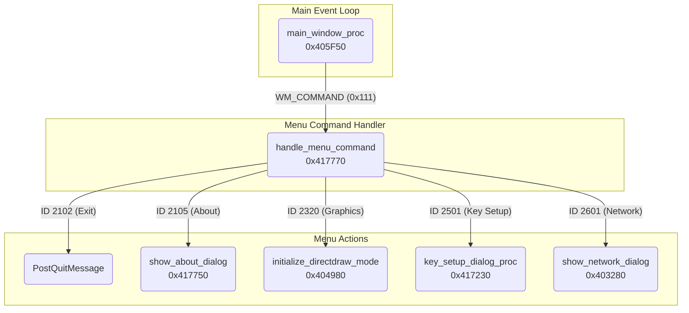

# Modernized Rendering Pipeline: A DirectDraw to SDL3 Migration Guide

This document provides a technical deep-dive into the successful migration of the game's rendering engine from its original, legacy DirectDraw implementation to a modern, flexible, and hardware-accelerated pipeline powered by SDL3. It details the analysis of the original engine's architecture and the design and implementation of its replacement.

---

## I. Analysis of the Original FM2K Engine Rendering Pipeline

A thorough understanding of the original engine was necessary to ensure a compatible and feature-complete replacement.

### A. Core Rendering and Windowing

The engine featured a dual rendering system, allowing it to switch between a hardware-accelerated DirectDraw mode and a software-based GDI fallback mode.

#### 1. Window Creation (`initialize_game_window_and_graphics` @ `0x4056C0`)
The game creates a standard Win32 window with a specific class name and style flags. This function is the entry point for setting up the main application window.

```cpp
// Original Window Creation
WNDCLASSA WndClass;
WndClass.lpfnWndProc = main_window_proc; // The main message handler
WndClass.lpszMenuName = "CUPID_MENU";
// ... other properties

CreateWindowExA(
    WS_EX_APPWINDOW,
    "ClassName",
    "WindowName",
    WS_OVERLAPPED | WS_CAPTION | WS_SYSMENU | WS_MINIMIZEBOX,
    // ... position and size ...
);
```

#### 2. DirectDraw Initialization (`initialize_directdraw_mode` @ `0x404980`)
This function was responsible for setting up the hardware-accelerated rendering path.
- **Key Steps**:
  1. Creates the main `IDirectDraw` object.
  2. Sets the `DDSCL_NORMAL` cooperative level.
  3. Creates a primary surface (for the screen) and a back buffer (for double buffering).

#### 3. GDI Fallback Rendering (`render_frame_gdi`)
If DirectDraw failed or was disabled, the engine fell back to using the Windows GDI for software rendering.
- **Key Steps**:
  1. Gets the Device Context (`HDC`) for the main window.
  2. Uses `BitBlt` or `StretchBlt` to copy the game's off-screen buffer to the window.

### B. Surface and Memory Management

The engine relied on a set of `IDirectDrawSurface` objects for all rendering operations.
- **Primary Surface**: Represents the visible screen.
- **Back Buffer**: An off-screen buffer (640x480) where the next frame is drawn before being "flipped" to the primary surface.
- **Sprite Surface**: A dedicated 256x256 surface, likely for sprite composition.
- **Graphics Surface**: Another buffer for UI elements or special effects.

The engine also pre-allocates a large global memory pool for all its subsystems, including graphics buffers.

### C. Window Procedure and Menu System

The entire user interface, including the main menu and configuration dialogs, was built using the standard Windows API. All interactions were processed through a central window procedure.

#### Control Flow Diagram



-   **`main_window_proc` @ `0x405F50`**: The core `WndProc` handles messages like `WM_CREATE`, `WM_PAINT`, and `WM_KEYDOWN`. Crucially, it dispatches `WM_COMMAND` messages to the menu handler.
-   **`handle_menu_command` @ `0x417770`**: A large `switch` statement that invokes different functions based on the menu item ID selected by the user (e.g., opening the key config dialog or exiting the application).

---

## II. SDL3 Migration Architecture & Implementation

The migration strategy was to replace the entire DirectDraw and GDI rendering stack with an SDL3-based system, while preserving the original game's logic and behavior. This was achieved through a combination of function hooking and creating a compatibility layer.

### A. Core Strategy: Window Hijacking

Instead of preventing the game from creating its window, we allow it to proceed and then "hijack" the created window handle (`HWND`) with SDL3. This is the cornerstone of the migration, providing maximum compatibility.

**File:** `hooks/impl/sdl3_context.cpp`

```cpp
// from CreateMainWindow_new in sdl3_context.cpp
// 1. Create the SDL3 window. We control this process.
g_sdlContext.window = SDL_CreateWindow(
    "Moon Lights 2 Ver.1.07",
    windowWidth,
    windowHeight,
    SDL_WINDOW_RESIZABLE
);

// 2. Get the native HWND from the created SDL3 window.
HWND hwnd = (HWND)SDL_GetPointerProperty(
    SDL_GetWindowProperties(g_sdlContext.window), 
    SDL_PROP_WINDOW_WIN32_HWND_POINTER, 
    NULL
);

// 3. Subclass the window to intercept and forward messages.
SubclassSDL3Window(hwnd);

// 4. Return the HWND to the game.
// The game logic now operates on a window that is secretly managed by SDL3.
return hwnd;
```

### B. Graphics Context and Surface Replacement

All `IDirectDrawSurface` objects are replaced with `SDL_Texture` objects, managed by an `SDL_Renderer`.

-   **`SDL_Renderer`**: An SDL3 renderer is created, specifically forcing the **Direct3D 11** backend for performance and stability on Windows.
-   **`SDL_Texture`**: Each DirectDraw surface is replaced by a corresponding texture. For example, `g_back_buffer` becomes `g_backTexture`.

**File:** `hooks/impl/sdl3_directdraw_compat_new.cpp`

```cpp
// from initDirectDraw_new in sdl3_directdraw_compat_new.cpp
// After the SDL3 context is initialized...

// Dummy interfaces are set up to satisfy the original game's global variable assignments.
// The game thinks it has DirectDraw pointers, but they point to our managed resources.
void** pThis = (void**)0x439848;
*pThis = &g_dummyDirectDraw; // Points to a fake DirectDraw object

void** pBackBuffer = (void**)0x439854;
*pBackBuffer = &g_backSurface; // Points to a struct that wraps our SDL_Texture
```

### C. The Dual-Rendering System for Pixel-Perfect Scaling

A major improvement is the implementation of a dual-buffer rendering system to handle resolution scaling correctly.

1.  **Game Buffer (`g_sdlContext.gameBuffer`)**: An `SDL_Texture` fixed at the game's native internal resolution (**256x240**). All original game rendering is directed to this texture.
2.  **Window Buffer (The Window Itself)**: The final, visible buffer presented to the user.

The rendering loop first draws the game world into the 256x240 `gameBuffer`. Then, that texture is scaled up to the main window, preserving the aspect ratio (letterboxing if necessary). This ensures crisp, pixel-perfect graphics at any window size.

**File:** `hooks/impl/sdl3_context.cpp`

```cpp
// from RenderGameToWindow in sdl3_context.cpp
void RenderGameToWindow() {
    // ...
    // Set render target to the window (nullptr)
    SDL_SetRenderTarget(g_sdlContext.renderer, nullptr);
    
    // Calculate scaling to maintain aspect ratio
    float windowAspect = (float)actualWindowWidth / actualWindowHeight;
    float gameAspect = (float)g_sdlContext.gameWidth / g_sdlContext.gameHeight; // 256/240
    
    SDL_FRect destRect; // The destination rectangle on the window
    // ... logic to calculate letterboxed destRect ...
    
    // Render the scaled game buffer to the window using NEAREST_NEIGHBOR filtering
    SDL_RenderTexture(g_sdlContext.renderer, g_sdlContext.gameBuffer, nullptr, &destRect);
}
```

### D. The Main Rendering Loop (`ProcessScreenUpdatesAndResources_new`)

This hooked function is the heart of the new rendering engine. It's called every frame by the game's main loop.

**File:** `hooks/impl/sdl3_directdraw_compat_new.cpp`

```cpp
// from ProcessScreenUpdatesAndResources_new
int __cdecl ProcessScreenUpdatesAndResources_new() {
    // 1. Update SDL events (input, window events, etc.)
    UpdateSDL3Events();
    
    // 2. Lock textures and copy game's pixel data from its memory buffers
    // to our SDL textures. This is where palette-to-RGB conversion happens.
    // ... (logic for SDL_LockTexture, memcpy, and color conversion) ...

    // 3. Render the game's main drawing surface to our 256x240 gameBuffer.
    SDL_SetRenderTarget(g_sdlContext.renderer, g_sdlContext.gameBuffer);
    SDL_RenderTexture(g_sdlContext.renderer, renderTexture, NULL, &destRect);

    // 4. Render the scaled game buffer to the window.
    RenderGameToWindow();
    
    // 5. Render any overlays (like ImGui menus) directly to the window.
    RenderImGuiSDL3();
    
    // 6. Present the final frame to the screen.
    PresentFrame();
    
    return 0;
}
```

### E. Palette and Color Management

The original game is 8-bit palettized. The new system must accurately convert the game's 8-bit indexed color data into the 32-bit RGBA format required by modern graphics cards.

**File:** `hooks/impl/palette_system.cpp`

-   An `SDL_Palette` object is created to hold the 256 colors used by the game.
-   The hooked function `UpdatePaletteEntries_new` intercepts the game's attempts to load color data (e.g., from `.PAL` or `.BMP` files).
-   This data is used to update the `SDL_Palette`.
-   During rendering, an 8-bit `SDL_Surface` (`g_indexedSurface`) is used as an intermediary. The game's raw pixel indices are copied into this surface. `SDL_CreateTextureFromSurface` then performs the hardware-accelerated color lookup and conversion, creating the final texture to be rendered. This is far more efficient than manual CPU-side conversion.

### F. GDI and UI Replacement

The original WinAPI menu and GDI calls are disabled or hooked.
-   **`GetDeviceCaps` Hook**: A critical hook in `gdi_hooks.cpp` intercepts the game's queries for the screen's color depth. It always returns `8` (for 8-bit), tricking the game's initialization logic into thinking it's running in a compatible 256-color mode.
-   **UI Replacement**: The original WinAPI menu is disabled. All new UI, such as the controller configuration and debug menus, is rendered using **ImGui** on top of the final scaled frame.

---

## III. Knowledge Summary

### What We Know
- The complete rendering flow of the original engine, from window creation to frame presentation, for both DirectDraw and GDI paths.
- All relevant memory addresses for global graphics variables, surfaces, and rendering functions.
- The window message handling and menu dispatch logic.
- The 8-bit palettized color format and how the game loads and manages palettes.
- The exact internal rendering resolution is 256x240.

### What We Still Need to Discover
- **Obscure Blitting Functions**: While the main rendering functions are hooked, there may be lesser-used blitting or drawing functions for specific effects (e.g., fades, transitions) that have not yet been identified and hooked.
- **VRAM Management**: The original engine had direct control over VRAM via DirectDraw. While we emulate its surfaces, the exact memory layouts and access patterns for certain graphical assets are not fully mapped. 