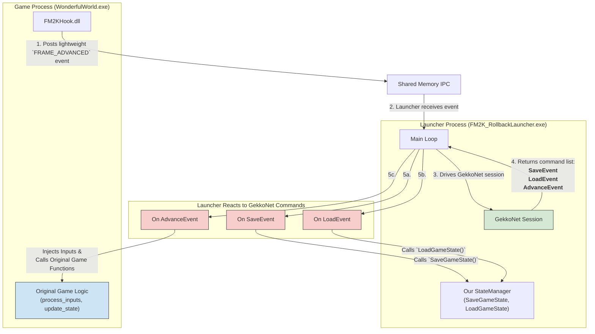

# July 8th - Early Afternoon Status & Next Steps

### Where We Left Off: A Stable Foundation

We have successfully completed the foundational phase of the project. Our core infrastructure is now stable, tested, and ready for the next stage.

*   **Robust IPC System**: We traced and fixed the "IPC buffer full" error. The root cause was a race condition where the launcher initialized IPC before the hook was ready. The system now uses a stable shared memory ring buffer, ensuring events flow correctly from the hook to the launcher at 100 FPS without overflow.

*   **Comprehensive State Management**: We have moved beyond placeholder state management.
    *   **`CoreGameState` Structure**: We implemented a detailed `CoreGameState` struct in `state_manager.h` that captures ~8KB of critical, deterministic game data, including player inputs, positions, health, timers, and the RNG seed.
    *   **Real State Capture**: The `SaveCoreState` and `LoadCoreState` functions now correctly read from and write to the specific memory addresses of the running game process.
    *   **Fletcher32 Checksums**: We replaced the placeholder `DEADBEEF` checksum with a real Fletcher32 checksum calculated over the entire `CoreGameState`. The logs confirm that checksums are now dynamic and change correctly as the game state evolves.

In short, we have a fully functional system that can **save and load the complete game state** and verify its integrity with a reliable checksum.

### What We Need to Do Next: GekkoNet Integration

With state management solved, the next logical and exciting phase is to integrate the **GekkoNet rollback engine**. Following the `OnlineSession.cpp` example as a guide, here is our plan of execution:

1.  **Integrate GekkoNet Library**: First, we will add the GekkoNet library to the `FM2K_RollbackLauncher` project and initialize a GekkoNet session when an online game is started.

2.  **Bridge Our IPC Events to GekkoNet**: We will connect our existing event system to the core GekkoNet callbacks.
    *   **`save_state`**: Our `OnStateSaved` IPC event will trigger GekkoNet's save state callback, providing it with the `CoreGameState` data we are now capturing.
    *   **`load_state`**: GekkoNet's load state callback (triggered during a rollback) will use our implemented `LoadCoreState` function to write a past state back into the game's memory.
    *   **`advance_frame`**: We will hand over control of the game's progression to GekkoNet. Our `OnFrameAdvanced` IPC event will now be used to drive GekkoNet's `advance_frame` function.

3.  **Hook and Feed Player Inputs**: We will intercept local player inputs and feed them directly into the GekkoNet session. GekkoNet will then handle synchronizing 2these inputs between both players, which is the core of how rollback netcode functions.

4.  **Test and Validate**: Using GekkoNet's built-in tools, like `netstats` and desync detection, we will thoroughly test the implementation to ensure save/load cycles work perfectly and the game state remains synchronized between clients. 

### GekkoNet Integration Architecture

Here is the diagram illustrating the correct, event-driven architecture we will build to integrate GekkoNet. This model delegates control of the game simulation to the GekkoNet session, which is the standard and most efficient design for rollback netcode.

### Optimizing State Saving: Beyond Full Snapshots

You've asked a fantastic question about optimization. The method we've implemented?saving the entire ~400KB game state every frame?is called a **full state snapshot**. It's the best way to start because it's robust and simple to debug. However, for a polished final product, more advanced techniques are often used to reduce memory usage and improve performance.

Here are the most common methods, including the delta compression you mentioned:

#### 1. Full State Snapshots (What We Are Doing Now)

*   **How it works:** Every time GekkoNet requests a save, we copy the entire block of memory representing the game state (~400KB) into GekkoNet's state buffer.
*   **Pros:**
    *   **Simple & Robust:** It's the easiest method to implement correctly. There's no complex logic, just a memory copy.
    *   **Fast Loads:** Restoring a state is just a single, fast `memcpy` back into the game's memory.
*   **Cons:**
    *   **High Memory Usage:** This is the biggest drawback. Storing 120 frames of history would require `120 * 400KB = ~48MB` of RAM, which is significant.
    *   **Slower Saves:** Copying a large block of memory can take time, although it's usually very fast on modern systems.

#### 2. Delta Compression (The "Shit That Sounds Highly Optimized")

This is the most common and effective optimization. You've understood the concept perfectly: you only save what has changed.

*   **How it works:** Instead of saving the full state every frame, you periodically save a full snapshot (a "keyframe"). For all frames in between, you compare the current state with the previous frame's state and only record the bytes that have changed (the "delta").
    *   To load Frame 10, you might load the keyframe from Frame 5 and then apply the deltas for frames 6, 7, 8, 9, and 10 in sequence.
*   **Pros:**
    *   **Massive Memory Reduction:** In fighting games, much of the game state is static from one frame to the next. The amount of changed data is often only a few hundred bytes instead of 400KB. Memory usage can be reduced by over 90%.
    *   **Faster Saves:** Writing a small delta is much faster than writing a full snapshot.
*   **Cons:**
    *   **More Complex:** You need a robust system to track changes, create delta patches, and apply them correctly.
    *   **Slower Loads:** Loading a state can be slower because you may need to apply multiple delta patches to reconstruct the full state. This is a classic time/space tradeoff.

#### 3. Copy-on-Write (CoW)

This is a very advanced, OS-level technique that offers incredible performance but is much harder to implement.

*   **How it works:** Instead of actively copying memory, you tell the operating system's virtual memory manager to mark the pages containing your game state as "read-only." When the game engine tries to write to this memory, the CPU triggers a page fault. The OS catches this, transparently makes a copy of *only that page* of memory for your process, and then lets the write to continue on the new copy. Your "savestate" is just the collection of these copied pages.
*   **Pros:**
    *   **Extremely Fast Saves:** The "save" operation is nearly instantaneous because you aren't copying any memory yourself. The OS handles everything on demand.
*   **Cons:**
    *   **Very High Complexity:** Requires low-level, platform-specific OS programming (`VirtualProtect`, page fault handling, etc.). It's significantly more complex than delta compression.
    *   **Platform Dependent:** Code written for Windows would not work on Linux or macOS without a complete rewrite.

**Conclusion & Our Path Forward:**

Starting with **full state snapshots** is the correct strategy. It allows us to focus on getting the core rollback logic right without introducing the complexity of state optimization. Once we have a fully functional GekkoNet integration, we can then profile our memory usage and performance. If needed, implementing **delta compression** would be our logical next step for optimization. 