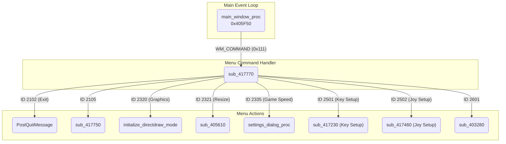

# Reversing Notes: WonderfulWorld Menu System

This document details the reverse engineering of the WinAPI-based menu and configuration system in `WonderfulWorld_ver_0946.exe`. The goal is to replace the existing Japanese-language UI with a modern, SDL-based implementation.

## What We Know

Our analysis has uncovered the primary components of the game's configuration UI:

### 1. Main Window Procedure (`main_window_proc` at `0x405F50`)

- This is the core `WndProc` for the main game window.
- It handles `WM_COMMAND` messages (ID `273`), which are triggered by menu item clicks.
- When a `WM_COMMAND` message is received, it calls `sub_417770` to handle the specific menu action.
- It also manages other essential window messages, including creation, destruction, resizing, and keyboard input (including debug hotkeys).

### 2. Menu Command Handler (`sub_417770`)

- This function acts as a dispatcher for all menu commands. It receives a command ID (`wParam`) from `main_window_proc`.
- It uses a `switch` statement to execute actions based on the command ID.
- Key actions include:
    - **ID 2102:** `PostQuitMessage` (Exit)
    - **ID 2320:** Toggle graphics mode
    - **ID 2321:** Resize window
    - **ID 2335:** Open "Game Speed" dialog (`settings_dialog_proc`)
    - **ID 2501:** Open "Key Setup" dialog (`sub_417230`)
    - **ID 2502:** Open "Joystick Setup" dialog (`sub_417460`)
    - **ID 2601:** Calls `sub_403280`

### 3. Dialog Procedures

We have analyzed the dialog procedures for the three main configuration screens. They all follow a similar pattern:

1.  **`WM_INITDIALOG`:** On initialization, the dialog loads current settings from global variables into temporary, dialog-specific buffers and populates UI controls (sliders, checkboxes, etc.).
2.  **`WM_COMMAND` / `WM_HSCROLL`:** User interactions (button clicks, slider movements) update the temporary buffers.
3.  **OK/Apply:** The "OK" button copies the values from the temporary buffers back into the global configuration variables.
4.  **Cancel:** The "Cancel" button discards the changes and closes the dialog.

The specific dialogs are:
- **Game Speed:** `settings_dialog_proc` (`0x4160F0`)
- **Key Setup:** `sub_417230` (`0x417230`), which uses `key_name_converter` (`0x416650`) to display key names.
- **Joystick Setup:** `sub_417460` (`0x417460`)

The Japanese text for these dialogs is located in the executable's resources and can be identified by the control IDs found in the decompiled code.

### 4. Control Flow Diagram

## What We Still Need to Discover

1.  **Analyze Remaining Functions:** The purpose of `sub_417750` and `sub_403280` is still unknown. They are called from the menu handler and should be investigated.
2.  **Inspect Resources:** Use a resource editor to view the dialog and menu resources directly. This will confirm control IDs and allow extraction of the original Japanese text for reference.
3.  **Global Variable Cross-References:** Trace where the global configuration variables (e.g., `g_graphics_mode`, `g_team_round`, keybinding variables) are read by the game's core logic to fully understand their impact.

## Plan for UI Replacement

The recommended approach is to use a DLL hook to replace the existing menu at runtime.

1.  **Disable the WinAPI Menu:** From the injected DLL (`FM2KHook.dll`), get the main window handle (`hWnd`) and call `SetMenu(hWnd, NULL);` to remove the existing menu bar. This is a non-destructive method that avoids permanent patching of the executable.
2.  **Implement an SDL-based UI:** Create a new UI using SDL rendering. This UI will be triggered by a hotkey or another in-game event.
3.  **Directly Modify Globals:** The new UI will read and write directly to the known global variables that control game settings. The addresses of these globals are known from our analysis. This bypasses the need to call the game's original dialog procedures.
4.  **Replicate Functionality:** The new UI should replicate all the options found in the original menu: graphics settings, game speed, key/joystick configuration, and exit. 